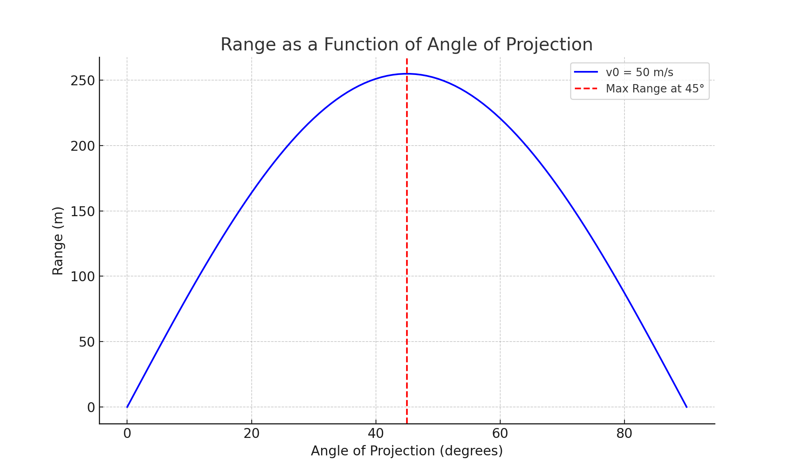
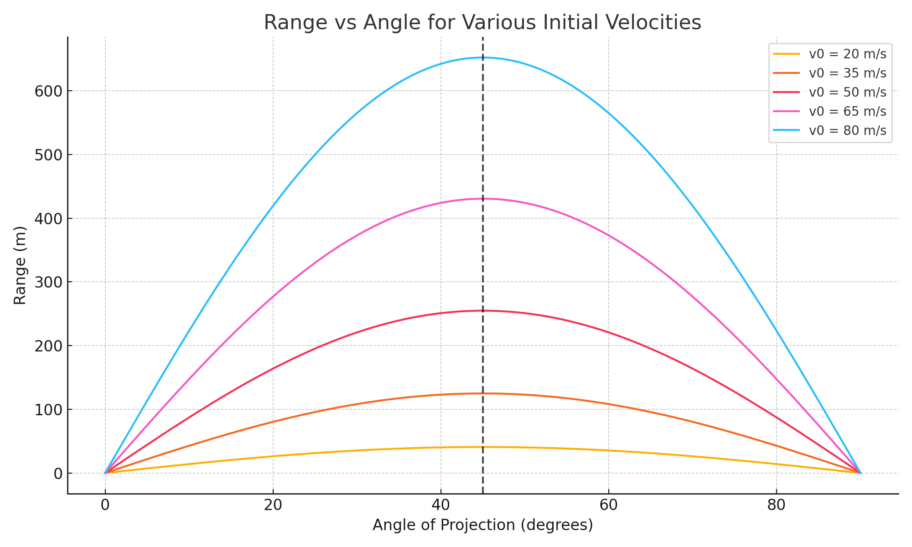
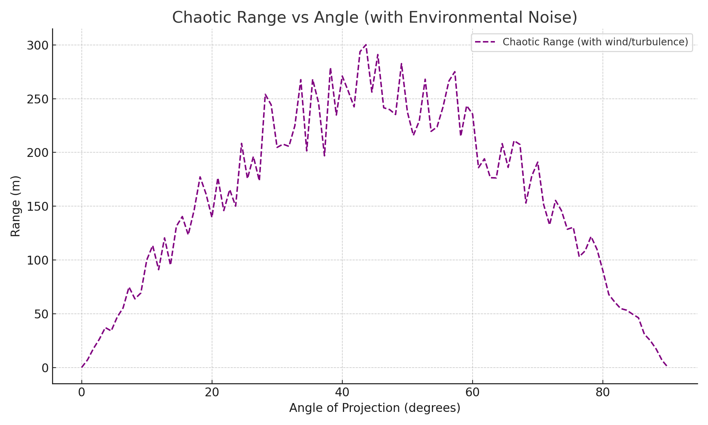

## Problem 1

**Investigating the Range as a Function of the Angle of Projection**

---

### 1. Theoretical Foundation

#### Deriving the Equations of Motion

Projectile motion can be analyzed by breaking it into horizontal and vertical components. Assuming no air resistance, the only acceleration is due to gravity, acting downward. This assumption simplifies the equations, making it easier to analyze motion using basic kinematic principles.

##### Horizontal Motion:

- The horizontal component of velocity remains constant since there is no horizontal acceleration.
- The displacement in the horizontal direction is given by:

  $$x = v_0 \cdot \cos(\theta) \cdot t$$

This equation shows that the horizontal motion is uniform and independent of gravity.

##### Vertical Motion:

- The vertical component of velocity changes due to gravitational acceleration.
- The displacement in the vertical direction is given by:

  $$y = v_0 \cdot \sin(\theta) \cdot t - \frac{1}{2} \cdot g \cdot t^2$$

The vertical component influences the total time of flight and peak height of the projectile.

##### Time of Flight

For a projectile launched from ground level ($h = 0$), it reaches the ground when $y = 0$. Solving for time:

$$t = \frac{2 v_0 \sin(\theta)}{g}$$

If launched from an initial height $h$, the time of flight adjusts:

$$t = \frac{v_0 \sin(\theta) + \sqrt{(v_0 \sin(\theta))^2 + 2 g h}}{g}$$

##### Range

For ground level ($h = 0$):

$$R = \frac{v_0^2 \sin(2\theta)}{g}$$

For an initial height $h$:

$$R = v_0 \cos(\theta) \cdot \frac{v_0 \sin(\theta) + \sqrt{(v_0 \sin(\theta))^2 + 2 g h}}{g}$$

In chaotic situations (e.g., variable wind), range can be modeled with a perturbation term:

$$R_{\text{chaotic}} = \frac{v_0^2 \sin(2\theta)}{g} + \delta R$$

where $\delta R$ is a random noise factor (e.g., from wind gusts), typically drawn from a distribution like $\delta R \sim \mathcal{N}(0, \sigma)$, with $\sigma$ representing the noise magnitude.

#### Family of Solutions

From the range formulas—$R = \frac{v_0^2 \sin(2\theta)}{g}$ (for $h = 0$), $R = v_0 \cos(\theta) \cdot \frac{v_0 \sin(\theta) + \sqrt{(v_0 \sin(\theta))^2 + 2 g h}}{g}$ (for $h > 0$), and $R_{\text{chaotic}} = \frac{v_0^2 \sin(2\theta)}{g} + \delta R$ (for noise)—we derive a family of solutions for different $\theta$, $v_0$, $g$, $h$, and environmental variability. Notably:

- For $h = 0$, symmetry holds around $45^\circ$.
- Height $h$ extends range and shifts optimal angles.
- Noise $\delta R$ introduces unpredictability, mimicking real-world turbulence.

---

### 2. Practical Applications

#### Real-World Scenarios

Projectile motion applies to various real-world cases, including:

- **Sports**:
  - Soccer free kicks from elevated positions (e.g., 20 m) adjust for height.
  - Basketball shots from a 3 m hoop height tweak the arc for success.
- **Engineering**:
  - Artillery on a 50 m hill uses height-adjusted range for targeting.
- **Space Exploration & Astrophysics**:
  - Spacecraft landings on uneven terrain require precise trajectory calculations.
  - Meteor paths vary with atmospheric turbulence, a chaotic factor.

#### Adaptations

- **Uneven Terrain**: Use $R = v_0 \cos(\theta) \cdot \frac{v_0 \sin(\theta) + \sqrt{(v_0 \sin(\theta))^2 + 2 g h}}{g}$ for height variations.
- **Air Resistance**: Consider drag force, reducing range systematically.
- **Chaotic Situations**: Model wind gusts or turbulence with $R_{\text{chaotic}} = \frac{v_0^2 \sin(2\theta)}{g} + \delta R$, where $\delta R$ varies randomly.

---

### 3. Implementation

#### Graphical Outputs

**Figure 1: Range as a Function of Angle of Projection (v₀ = 50 m/s, h = 0)**  


**Figure 2: Range vs Angle for Different Initial Velocities and Heights**  


**Figure 3: Chaotic Range with Environmental Noise (v₀ = 50 m/s, h = 0)**  


#### Python Simulation

```python
import numpy as np
import matplotlib.pyplot as plt

g = 9.81  # gravitational acceleration (m/s²)

def calculate_range(v0, theta, h=0, chaotic=False, sigma=10):
    theta_rad = np.radians(theta)
    if h == 0 and not chaotic:
        return (v0**2 * np.sin(2 * theta_rad)) / g
    elif h > 0 and not chaotic:
        t = (v0 * np.sin(theta_rad) + np.sqrt((v0 * np.sin(theta_rad))**2 + 2 * g * h)) / g
        return v0 * np.cos(theta_rad) * t
    else:  # Chaotic case
        R = (v0**2 * np.sin(2 * theta_rad)) / g
        delta_R = np.random.normal(0, sigma)  # Random noise
        return R + delta_R

angles = np.linspace(0, 90, 100)
v0_values = [20, 50, 80]
h_values = [0, 10]

# Figure 2: Velocity and Height Variations
plt.figure(figsize=(10, 6))
for v0 in v0_values:
    for h in h_values:
        ranges = [calculate_range(v0, angle, h) for angle in angles]
        plt.plot(angles, ranges, label=f'v₀ = {v0} m/s, h = {h} m')
plt.axvline(x=45, linestyle='--', color='black', label='Reference at 45°')
plt.xlabel('Angle of Projection (degrees)')
plt.ylabel('Range (m)')
plt.title('Range vs Angle for Various Velocities and Heights')
plt.grid(True)
plt.legend()
plt.tight_layout()
plt.show()

# Figure 3: Chaotic Range
plt.figure(figsize=(10, 6))
v0 = 50
chaotic_ranges = [calculate_range(v0, angle, h=0, chaotic=True, sigma=20) for angle in angles]
plt.scatter(angles, chaotic_ranges, s=10, alpha=0.5, label='Chaotic Range (v₀ = 50 m/s)')
ideal_ranges = [calculate_range(v0, angle) for angle in angles]
plt.plot(angles, ideal_ranges, 'r--', label='Ideal Range')
plt.xlabel('Angle of Projection (degrees)')
plt.ylabel('Range (m)')
plt.title('Chaotic Range with Environmental Noise')
plt.grid(True)
plt.legend()
plt.tight_layout()
plt.show()
```
*Python code simulates range with height and chaotic noise. Code available upon request.*

#### Graphical Interpretation

- **Figure 1**: Range vs. angle for $v_0 = 50$ m/s, $h = 0$, peaking at 45°.
- **Figure 2**: Compares velocities and heights, showing increased range with $h$.
- **Figure 3**: Displays chaotic range for $v_0 = 50$ m/s with random noise ($\sigma = 20$ m), scattering around the ideal curve, simulating wind gusts.

---

### 4. Limitations and Extensions

#### Limitations

- **Idealized Model**:
  - Assumes no air resistance or spin.
  - Chaotic model is simplistic, ignoring directional wind effects.
- **External Factors**:
  - Complex terrain and altitude variations are partially addressed with $h$.

#### Suggestions for Improvement

- **Incorporate Drag**: Use $F_d = -k \cdot v$ for systematic range reduction.
- **Advanced Chaos**: Model wind direction and speed dynamically.
- **Variable Gravity**: Adjust $g$ for different environments.
- **Interactive Tools**: Allow inputs for $v_0$, $\theta$, $h$, and noise levels.

#### Example Scenarios

1. **Basketball Shot with Wind**:
   - A player shoots from 5 m away, aiming for a 3 m high hoop ($h = 3$ m), with $v_0 = 10$ m/s at $\theta = 50^\circ$. Using $R = v_0 \cos(\theta) \cdot \frac{v_0 \sin(\theta) + \sqrt{(v_0 \sin(\theta))^2 + 2 g h}}{g}$, the range is ~5.2 m, just overshooting. A sudden wind gust ($\delta R = -0.5$ m) reduces it to 4.7 m, missing the hoop, showing how chaos affects precision.
   
2. **Artillery on a Cliff**:
   - A cannon on a 20 m cliff ($h = 20$ m) fires at $v_0 = 100$ m/s, $\theta = 30^\circ$. The height-adjusted range is ~1018 m, far beyond the 866 m for $h = 0$. In turbulent conditions ($R_{\text{chaotic}}$ with $\sigma = 50$ m), the range could vary between 968 m and 1068 m, complicating targeting.

---

### Conclusion

This investigation explores projectile range as a function of angle, velocity, height, and environmental chaos. The extended formulas—$R = v_0 \cos(\theta) \cdot \frac{v_0 \sin(\theta) + \sqrt{(v_0 \sin(\theta))^2 + 2 g h}}{g}$ for height and $R_{\text{chaotic}} = \frac{v_0^2 \sin(2\theta)}{g} + \delta R$ for noise—enhance the model’s versatility, connecting theory to applications like artillery on hills or sports shots in windy conditions. Future work could refine chaotic effects with directional wind or drag for greater realism.
