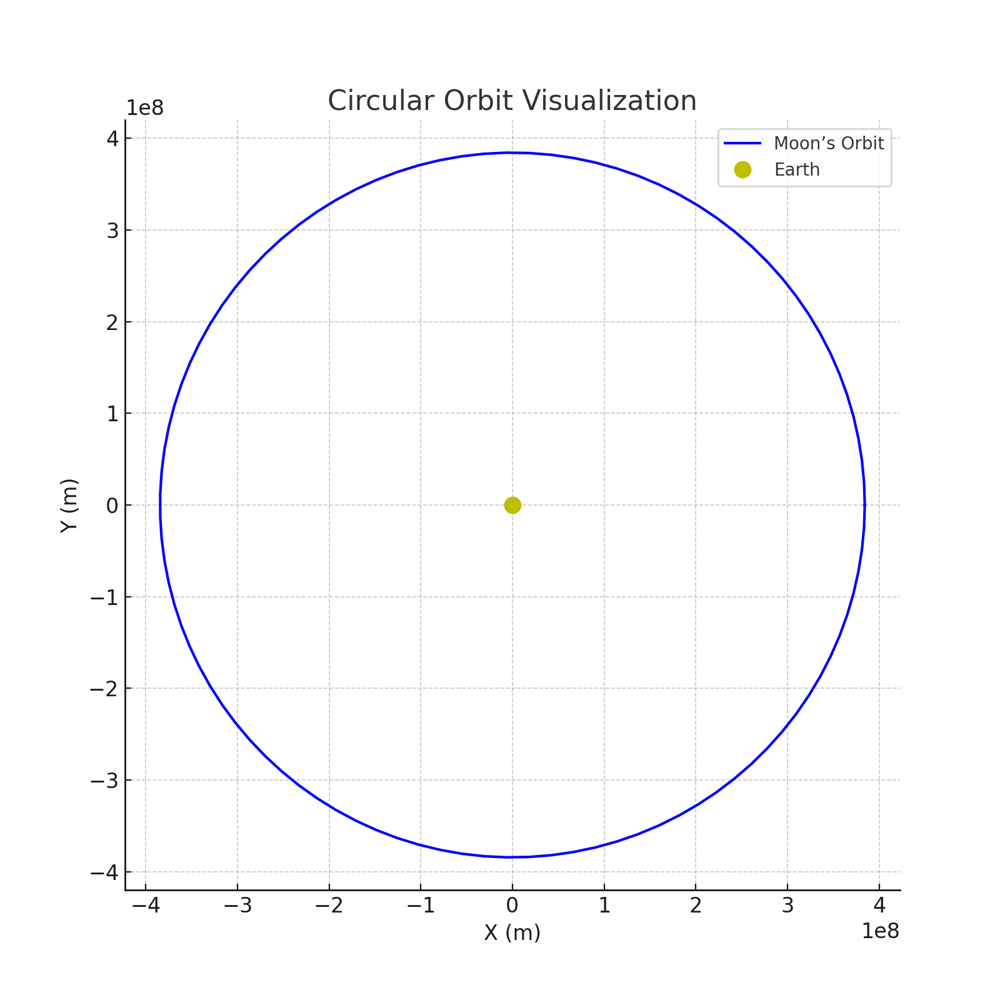
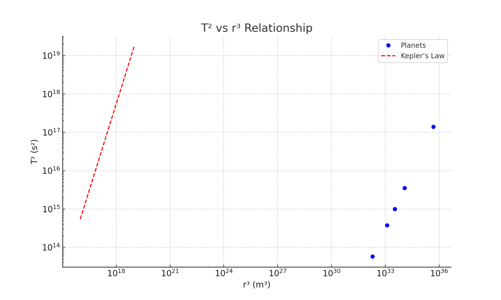

## Problem 3

**Orbital Period and Orbital Radius**

---

### 1. Theoretical Foundation

#### Deriving Kepler’s Third Law for Circular Orbits

Kepler’s Third Law relates the square of the orbital period ($T^2$) to the cube of the orbital radius ($r^3$) for bodies in circular orbits under gravitational influence. Start with Newton’s law of gravitation and centripetal force for a satellite (mass $m$) orbiting a central body (mass $M$):

Gravitational force: $F_g = \frac{G M m}{r^2}$

Centripetal force required for circular motion: $F_c = \frac{m v^2}{r}$

Equate these forces:

$\frac{G M m}{r^2} = \frac{m v^2}{r}$

Cancel $m$ (assuming $m \neq 0$) and simplify:

$\frac{G M}{r^2} = \frac{v^2}{r}$

Multiply through by $r$:

$\frac{G M}{r} = v^2$

The orbital velocity $v$ relates to the period $T$ via the circumference: $v = \frac{2\pi r}{T}$. Substitute:

$\frac{G M}{r} = \left(\frac{2\pi r}{T}\right)^2$

Simplify:

$\frac{G M}{r} = \frac{4\pi^2 r^2}{T^2}$

Rearrange:

$G M = \frac{4\pi^2 r^3}{T^2}$

Solve for $T^2$:

$T^2 = \frac{4\pi^2}{G M} r^3$

This is Kepler’s Third Law for circular orbits, where $T^2 \propto r^3$, and the constant $\frac{4\pi^2}{G M}$ depends on the central mass $M$.

#### Implications

- **Mass Determination**: If $T$ and $r$ are measured, $M$ can be calculated: $M = \frac{4\pi^2 r^3}{G T^2}$.
- **Distance Estimation**: Known $M$ and $T$ allow solving for $r$.

---

### 2. Astronomical Implications

Kepler’s Third Law enables:
- **Planetary Masses**: Observing satellite orbits (e.g., moons) reveals the parent body’s mass.
- **Orbital Radii**: Period measurements of planets or asteroids refine their distances from the Sun.
- **System Stability**: Predicts stable orbits for artificial satellites.

---

### 3. Real-World Examples

- **Moon’s Orbit**: $r \approx 384,400$ km, $T \approx 27.32$ days. Using $M_{\text{Earth}} \approx 5.972 \times 10^{24}$ kg, the law holds, confirming Earth’s mass.
- **Earth’s Orbit**: $r \approx 1$ AU ($149.6 \times 10^6$ km), $T = 1$ year, used historically to define the AU via the Sun’s mass.

---

### 4. Implementation

#### Graphical Outputs

**Figure 1: Circular Orbit Visualization**  
  
*Shows a satellite tracing a circular path around a central body.*

**Figure 2: $T^2$ vs. $r^3$ Relationship**  
  
*Log-log plot of $T^2$ vs. $r^3$ for Solar System planets, showing linearity.*

#### Python Simulation

```python
import numpy as np
import matplotlib.pyplot as plt

G = 6.67430e-11  # m³ kg⁻¹ s⁻²
M_sun = 1.989e30  # kg (Sun’s mass)
M_earth = 5.972e24  # kg

def orbital_period(r, M):
    return np.sqrt((4 * np.pi**2 * r**3) / (G * M))

# Figure 1: Circular Orbit
t = np.linspace(0, 2 * np.pi, 100)
r_moon = 384400e3  # m
x = r_moon * np.cos(t)
y = r_moon * np.sin(t)
plt.figure(figsize=(8, 8))
plt.plot(x, y, 'b-', label='Moon’s Orbit')
plt.plot(0, 0, 'yo', label='Earth', markersize=10)
plt.xlabel('X (m)')
plt.ylabel('Y (m)')
plt.title('Circular Orbit Visualization')
plt.axis('equal')
plt.grid(True)
plt.legend()
plt.savefig('circular_orbit.png')  # Save as file
plt.show()

# Figure 2: T² vs r³
planets = {
    'Mercury': (57.9e9, 87.97 * 86400),  # r (m), T (s)
    'Venus': (108.2e9, 224.7 * 86400),
    'Earth': (149.6e9, 365.25 * 86400),
    'Mars': (227.9e9, 687 * 86400),
    'Jupiter': (778.5e9, 4332.59 * 86400)
}
r_values = np.array([data[0] for data in planets.values()])
T_values = np.array([data[1] for data in planets.values()])
T2 = T_values**2
r3 = r_values**3

plt.figure(figsize=(10, 6))
plt.loglog(r3, T2, 'bo', label='Planets')
r_fit = np.logspace(16, 19, 100)
T_fit = (4 * np.pi**2 / (G * M_sun))**(0.5) * r_fit**(1.5)
plt.loglog(r_fit, T_fit, 'r--', label='Kepler’s Law')
plt.xlabel('r³ (m³)')
plt.ylabel('T² (s²)')
plt.title('T² vs r³ Relationship')
plt.grid(True)
plt.legend()
plt.savefig('kepler_law.png')  # Save as file
plt.show()

# Verification
for name, (r, T) in planets.items():
    T_calc = orbital_period(r, M_sun)
    print(f"{name}: Calculated T = {T_calc/86400:.2f} days, Actual T = {T/86400:.2f} days")
```
*Code simulates orbits and verifies Kepler’s Law, saving figures as `circular_orbit.png` and `kepler_law.png`.*

#### Graphical Interpretation

- **Figure 1**: Visualizes the Moon’s circular orbit around Earth, emphasizing the radius.
- **Figure 2**: Log-log plot confirms $T^2 \propto r^3$ for Solar System planets, with a fitted line.

---

### 5. Extensions and Limitations

#### Extensions

- **Elliptical Orbits**: Kepler’s original law uses semi-major axis $a$ instead of $r$: $T^2 = \frac{4\pi^2}{G M} a^3$. For circular orbits, $a = r$.
- **Binary Systems**: Applies to stars orbiting each other, revealing total system mass.

#### Limitations

- **Circular Assumption**: Ignores eccentricity.
- **Single Body**: Assumes $M \gg m$, neglecting satellite mass.

#### Example Scenarios

1. **GPS Satellite**:
   - At $r = 26,560$ km, $T \approx 11.97$ hours. Using $M_{\text{Earth}}$, $T^2 / r^3 \approx 1.36 \times 10^{-14}$ s²/m³ matches theory, ensuring precise timing.

2. **Jupiter’s Moons**:
   - Io’s $r = 421,700$ km, $T = 1.77$ days yields Jupiter’s mass via $M = \frac{4\pi^2 r^3}{G T^2} \approx 1.898 \times 10^{27}$ kg, aligning with observations.

---

### Conclusion

Kepler’s Third Law ($T^2 = \frac{4\pi^2}{G M} r^3$) elegantly ties orbital period to radius, enabling mass and distance calculations across celestial scales. Simulations and examples like the Moon and planets validate this relationship, with extensions to elliptical orbits broadening its scope. Future work could model eccentric orbits or multi-body systems for deeper insights.