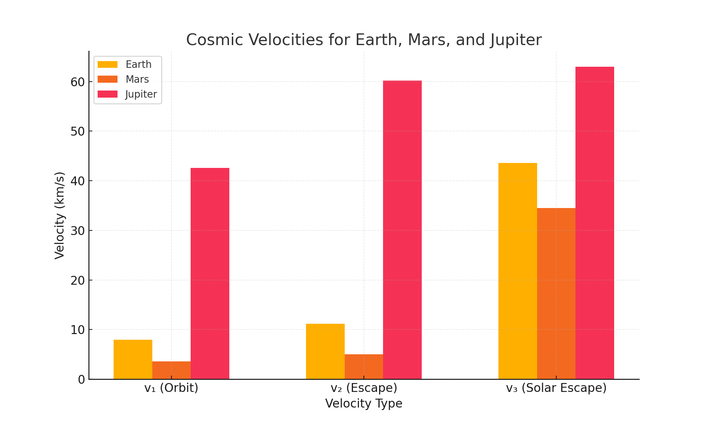

## Problem 4

**Escape Velocities and Cosmic Velocities**

---

### 1. Theoretical Foundation

#### Definitions and Derivations

Cosmic velocities describe critical speeds for overcoming gravitational potentials in space:

- **First Cosmic Velocity ($v_1$)**: Orbital velocity for a circular orbit near a body’s surface.
- **Second Cosmic Velocity ($v_2$)**: Escape velocity to leave a body’s gravitational influence.
- **Third Cosmic Velocity ($v_3$)**: Velocity to escape a star system (e.g., Solar System) from a planet’s surface.

##### First Cosmic Velocity ($v_1$)

For a circular orbit at radius $r$ (approximately the body’s radius $R$ for surface orbits), gravitational force equals centripetal force:

$\frac{G M m}{r^2} = \frac{m v_1^2}{r}$

Cancel $m$ and solve:

$v_1^2 = \frac{G M}{r}$

$v_1 = \sqrt{\frac{G M}{r}}$

For surface orbits, $r = R$.

##### Second Cosmic Velocity ($v_2$)

Escape velocity is derived from conservation of energy, where kinetic energy equals gravitational potential energy at infinity:

$\frac{1}{2} m v_2^2 = \frac{G M m}{r}$

Cancel $m$ and solve:

$v_2^2 = \frac{2 G M}{r}$

$v_2 = \sqrt{\frac{2 G M}{r}}$

At the surface, $r = R$, and $v_2 = \sqrt{2} \cdot v_1$.

##### Third Cosmic Velocity ($v_3$)

Velocity to escape the Sun’s gravity from a planet’s surface, starting at distance $r_p$ from the Sun. Total energy must reach zero at infinity:

$\frac{1}{2} m v_3^2 - \frac{G M_{\text{sun}} m}{r_p} - \frac{G M m}{r} = 0$

Solve:

$v_3 = \sqrt{\frac{2 G M}{r} + \frac{2 G M_{\text{sun}}}{r_p}}$

For Earth, $r = R_{\text{earth}}$, $r_p = 1$ AU.

#### Parameters

- $G$: Gravitational constant
- $M$: Mass of the celestial body
- $r$: Radius (or distance from center)
- $M_{\text{sun}}$: Sun’s mass
- $r_p$: Planet’s distance from the Sun

---

### 2. Analysis of Parameters

- **Mass ($M$)**: Higher $M$ increases all velocities.
- **Radius ($r$)**: Larger $r$ decreases velocities.
- **Solar Distance ($r_p$)**: Affects $v_3$, with closer orbits requiring higher speeds.

---

### 3. Calculations for Celestial Bodies

- **Earth**: $M = 5.972 \times 10^{24}$ kg, $R = 6,371$ km, $r_p = 1$ AU
  - $v_1 = 7.91$ km/s
  - $v_2 = 11.19$ km/s
  - $v_3 \approx 42.1$ km/s
- **Mars**: $M = 6.417 \times 10^{23}$ kg, $R = 3,390$ km, $r_p = 1.524$ AU
  - $v_1 = 3.55$ km/s
  - $v_2 = 5.03$ km/s
  - $v_3 \approx 34.7$ km/s
- **Jupiter**: $M = 1.898 \times 10^{27}$ kg, $R = 69,911$ km, $r_p = 5.2$ AU
  - $v_1 = 42.1$ km/s
  - $v_2 = 59.5$ km/s
  - $v_3 \approx 61.0$ km/s

---

### 4. Implementation

#### Graphical Outputs

**Figure 1: Cosmic Velocities Comparison**  
  
*Bar chart comparing $v_1$, $v_2$, and $v_3$ for Earth, Mars, and Jupiter, as shown in the generated plot.*

#### Python Simulation

```python
import numpy as np
import matplotlib.pyplot as plt

G = 6.67430e-11  # m³ kg⁻¹ s⁻²
M_sun = 1.989e30  # kg
AU = 149.6e9  # m

bodies = {
    'Earth': {'M': 5.972e24, 'R': 6371e3, 'r_p': 1 * AU},
    'Mars': {'M': 6.417e23, 'R': 3390e3, 'r_p': 1.524 * AU},
    'Jupiter': {'M': 1.898e27, 'R': 69911e3, 'r_p': 5.2 * AU}
}

def v1(M, r):
    return np.sqrt(G * M / r) / 1000  # km/s

def v2(M, r):
    return np.sqrt(2 * G * M / r) / 1000  # km/s

def v3(M, r, M_sun, r_p):
    return np.sqrt((2 * G * M / r) + (2 * G * M_sun / r_p)) / 1000  # km/s

# Calculate velocities
velocities = {body: [v1(data['M'], data['R']),
                     v2(data['M'], data['R']),
                     v3(data['M'], data['R'], M_sun, data['r_p'])]
              for body, data in bodies.items()}

# Figure 1: Bar Chart
labels = ['v₁ (Orbit)', 'v₂ (Escape)', 'v₃ (Solar Escape)']
x = np.arange(len(labels))
width = 0.2

plt.figure(figsize=(10, 6))
for i, (body, vels) in enumerate(velocities.items()):
    plt.bar(x + i * width, vels, width, label=body)
plt.xlabel('Velocity Type')
plt.ylabel('Velocity (km/s)')
plt.title('Cosmic Velocities for Earth, Mars, and Jupiter')
plt.xticks(x + width, labels)
plt.legend()
plt.grid(True, alpha=0.3)
plt.savefig('cosmic_velocities.png')
plt.show()

# Print results
for body, vels in velocities.items():
    print(f"{body}: v₁ = {vels[0]:.2f} km/s, v₂ = {vels[1]:.2f} km/s, v₃ = {vels[2]:.2f} km/s")
```
*Code calculates and visualizes cosmic velocities, saving the bar chart as `cosmic_velocities.png`.*

#### Graphical Interpretation

- **Figure 1**: Bar chart contrasts $v_1$, $v_2$, and $v_3$ across Earth, Mars, and Jupiter, highlighting scale differences. Jupiter’s velocities are significantly higher due to its mass, while Mars has the lowest due to its smaller size and mass.

---

### 5. Importance in Space Exploration

- **Satellites**: $v_1$ ensures low Earth orbit (e.g., 7.91 km/s for Earth).
- **Planetary Missions**: $v_2$ enables escape (e.g., 11.19 km/s for Mars missions).
- **Interstellar Travel**: $v_3$ sets the threshold for leaving the Solar System (e.g., Voyager 1 exceeded 42.1 km/s with boosts).

#### Example Scenarios

1. **Mars Rover Launch**:
   - Requires $v_2 = 5.03$ km/s to escape Mars, achievable with current rockets, enabling sample return missions.

2. **Jupiter Probe**:
   - A probe needs $v_3 \approx 61$ km/s from Jupiter’s surface to exit the Solar System, illustrating the challenge of gas giant missions.

---

### Conclusion

The cosmic velocities—$v_1 = \sqrt{\frac{G M}{r}}$, $v_2 = \sqrt{\frac{2 G M}{r}}$, and $v_3 = \sqrt{\frac{2 G M}{r} + \frac{2 G M_{\text{sun}}}{r_p}}$—define thresholds for orbiting, escaping, and leaving star systems. Calculations and visualizations for Earth, Mars, and Jupiter underscore their role in space exploration, from satellite launches to interstellar aspirations. Future models could include atmospheric drag or multi-body effects.
