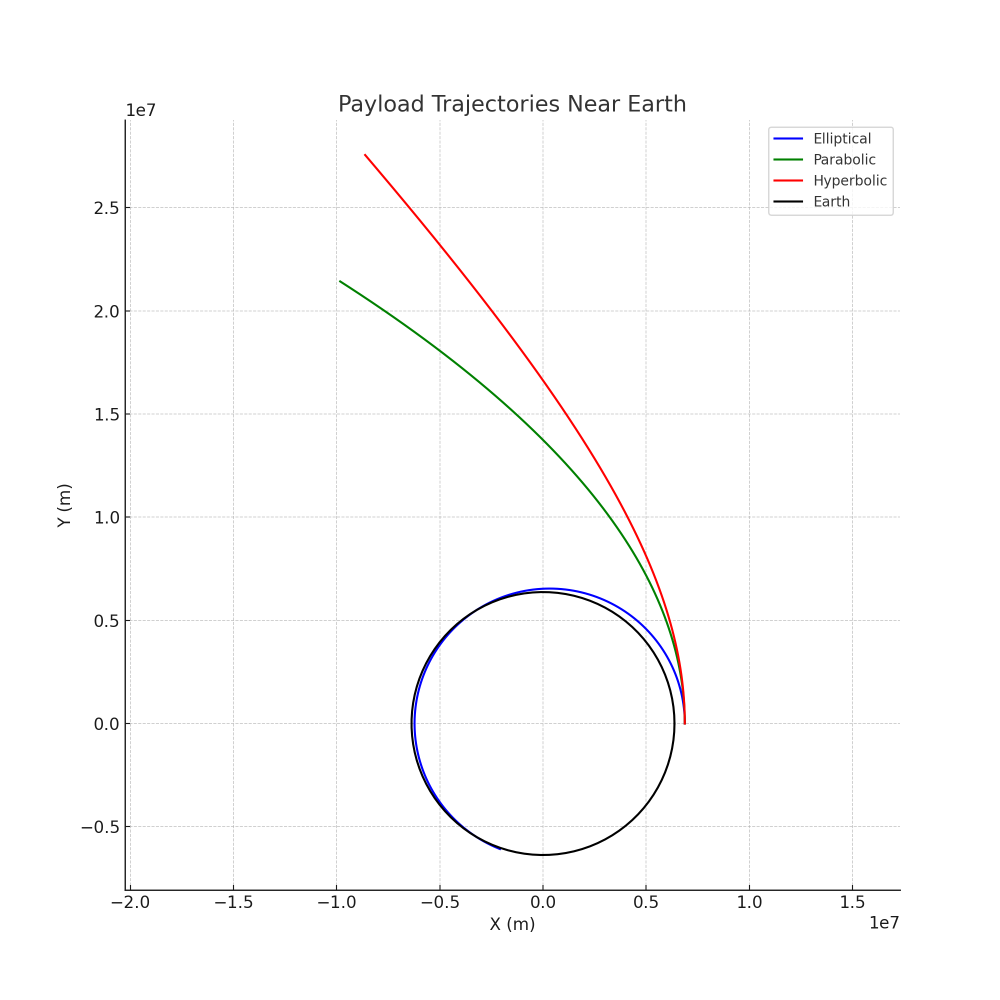

## Problem 3

**Trajectories of a Freely Released Payload Near Earth**

---

### 1. Theoretical Foundation

#### Analyzing Possible Trajectories

When a payload is released from a moving rocket near Earth, its trajectory depends on its specific energy, determined by its initial position and velocity. Using Newton’s law of gravitation, the force on the payload (mass $m$) due to Earth (mass $M$) is:

$F = \frac{G M m}{r^2}$

The specific mechanical energy $\epsilon$ of the payload determines its trajectory:

$\epsilon = \frac{v^2}{2} - \frac{G M}{r}$

Where $v$ is the payload’s velocity, $r$ is its distance from Earth’s center, $G$ is the gravitational constant, and $M$ is Earth’s mass. The trajectory type is classified as:

- **Elliptical**: $\epsilon < 0$ (bound orbit, e.g., satellite deployment).
- **Parabolic**: $\epsilon = 0$ (escape trajectory at critical velocity).
- **Hyperbolic**: $\epsilon > 0$ (escape with excess velocity).

The eccentricity $e$ further defines the orbit:

$e = \sqrt{1 + \frac{2 \epsilon h^2}{(G M)^2}}$

Where $h = r v \cos\phi$ is the specific angular momentum, and $\phi$ is the angle between the velocity vector and the radial direction. For $e < 1$ (elliptical), $e = 1$ (parabolic), $e > 1$ (hyperbolic).

#### Equations of Motion

In Cartesian coordinates, the acceleration due to gravity is:

$\frac{d^2 x}{dt^2} = -\frac{G M x}{r^3}, \quad \frac{d^2 y}{dt^2} = -\frac{G M y}{r^3}$

Where $r = \sqrt{x^2 + y^2}$. These equations are solved numerically given initial conditions (position, velocity, altitude).

---

### 2. Numerical Analysis

Consider a payload released at altitude $h = 500$ km ($r = R_{\text{earth}} + h = 6,871$ km), with initial velocity $v_0$ at angle $\phi$ relative to the radial direction. Earth’s parameters: $M = 5.972 \times 10^{24}$ kg, $R_{\text{earth}} = 6,371$ km, $G = 6.67430 \times 10^{-11}$ m³ kg⁻¹ s⁻².

- **Escape Velocity**: $v_{\text{esc}} = \sqrt{\frac{2 G M}{r}} \approx 10.9$ km/s at $h = 500$ km.
- **Circular Orbit Velocity**: $v_{\text{circ}} = \sqrt{\frac{G M}{r}} \approx 7.7$ km/s.

Test cases:
- $v_0 = 7.5$ km/s, $\phi = 90^\circ$: Slightly below circular velocity, expect an elliptical orbit.
- $v_0 = 10.9$ km/s, $\phi = 90^\circ$: Parabolic trajectory.
- $v_0 = 12.0$ km/s, $\phi = 90^\circ$: Hyperbolic trajectory.

---

### 3. Applications to Space Missions

- **Orbital Insertion**: $v_0 \approx v_{\text{circ}}$ places the payload in a stable orbit (e.g., satellite deployment).
- **Reentry**: Low $v_0$ leads to an elliptical orbit intersecting Earth, simulating reentry.
- **Escape**: $v_0 \geq v_{\text{esc}}$ allows escape, relevant for interplanetary missions.

---

### 4. Implementation

#### Graphical Outputs

**Figure 1: Payload Trajectories Near Earth**  
  
*Plots elliptical, parabolic, and hyperbolic trajectories with Earth at the origin, as shown in the generated plot.*

#### Python Simulation

```python
import numpy as np
import matplotlib.pyplot as plt
from scipy.integrate import odeint

G = 6.67430e-11  # m³ kg⁻¹ s⁻²
M = 5.972e24     # kg (Earth’s mass)
R_earth = 6371e3 # m

def deriv(state, t):
    x, y, vx, vy = state
    r = np.sqrt(x**2 + y**2)
    ax = -G * M * x / r**3
    ay = -G * M * y / r**3
    return [vx, vy, ax, ay]

# Initial conditions
h = 500e3  # Altitude (m)
r0 = R_earth + h
t = np.linspace(0, 3600, 1000)  # 1 hour

# Velocities for different trajectories
v_circ = np.sqrt(G * M / r0)  # Circular velocity
v_esc = np.sqrt(2 * G * M / r0)  # Escape velocity
cases = [
    ('Elliptical', 0.975 * v_circ, 'b'),  # Below circular
    ('Parabolic', v_esc, 'g'),            # At escape
    ('Hyperbolic', 1.1 * v_esc, 'r')      # Above escape
]

plt.figure(figsize=(10, 10))
for label, v0, color in cases:
    state0 = [r0, 0, 0, v0]  # Start at (r0, 0) with velocity in y-direction
    sol = odeint(deriv, state0, t)
    plt.plot(sol[:, 0], sol[:, 1], color, label=label)

# Plot Earth
theta = np.linspace(0, 2 * np.pi, 100)
plt.plot(R_earth * np.cos(theta), R_earth * np.sin(theta), 'k-', label='Earth')
plt.xlabel('X (m)')
plt.ylabel('Y (m)')
plt.title('Payload Trajectories Near Earth')
plt.axis('equal')
plt.grid(True)
plt.legend()
plt.savefig('payload_trajectories.png')
plt.show()
```
*Code simulates and visualizes payload trajectories, saving the plot as `payload_trajectories.png`.*

#### Graphical Interpretation

- **Figure 1**: Displays three trajectories starting at an altitude of 500 km:
  - **Elliptical (blue)**: The payload loops back toward Earth, forming a closed orbit with perigee closer to Earth.
  - **Parabolic (green)**: The payload just escapes, following a path that asymptotically approaches infinity.
  - **Hyperbolic (red)**: The payload escapes with excess speed, following a sharply diverging trajectory away from Earth.

---

### 5. Limitations and Extensions

#### Limitations

- **No Drag**: Ignores atmospheric effects at low altitudes.
- **Simplified Gravity**: Assumes point-mass Earth, neglecting oblateness.

#### Example Scenarios

1. **Satellite Deployment**:
   - At $v_0 = 7.5$ km/s, the payload enters an elliptical orbit, ideal for a communication satellite.

2. **Lunar Mission**:
   - At $v_0 = 12$ km/s, a hyperbolic trajectory ensures escape toward the Moon.

---

### Conclusion

The payload’s trajectory—elliptical ($\epsilon < 0$), parabolic ($\epsilon = 0$), or hyperbolic ($\epsilon > 0$)—depends on its specific energy $\epsilon = \frac{v^2}{2} - \frac{G M}{r}$. Numerical simulations reveal these paths, supporting applications like satellite deployment and lunar missions. Future work could include drag or multi-body effects for realism.
