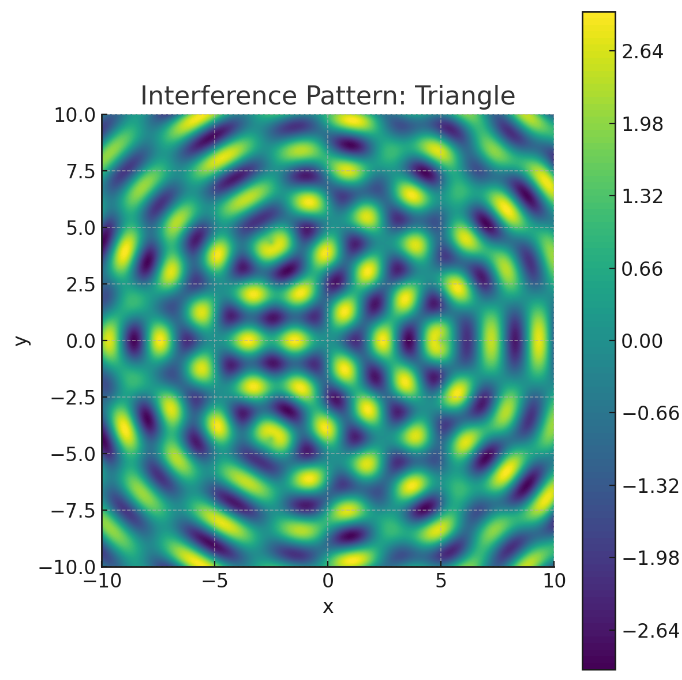
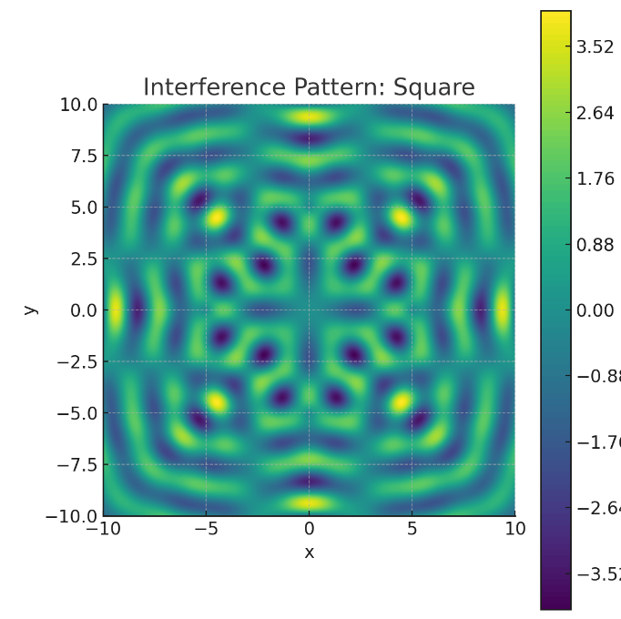
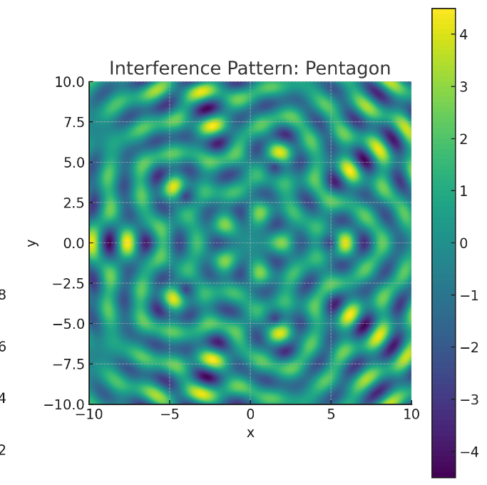
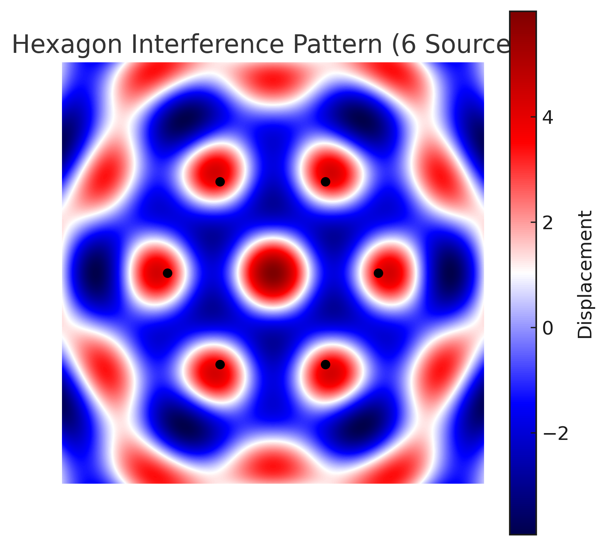

# Interference Patterns on a Water Surface

## Motivation
Interference occurs when waves from different sources overlap, creating new patterns. On a water surface, this can be observed when ripples from different points meet, forming distinctive interference patterns. These patterns show how waves combine, either reinforcing each other (constructive interference) or canceling out (destructive interference).

Studying these patterns helps us understand wave behavior in a simple, visual way. It also allows us to explore concepts like the relationship between wave phase and the effects of multiple sources. This task offers a hands-on approach to learning about wave interactions and their real-world applications, making it an interesting and engaging way to dive into wave physics.

## Task
We need to analyze the interference patterns formed on a water surface due to the superposition of waves emitted from point sources placed at the vertices of a regular polygon. The wave from a single source at position $(x_i, y_i)$ is given by:

$$
\eta_i(x, y, t) = A \cos(k r_i - \omega t + \phi_i)
$$

where:
- $\eta_i(x, y, t)$: Displacement at point $(x, y)$ at time $t$.
- $A$: Amplitude.
- $k = \frac{2\pi}{\lambda}$: Wave number, with $\lambda$ as the wavelength.
- $r_i = \sqrt{(x - x_i)^2 + (y - y_i)^2}$: Distance from the source to point $(x, y)$.
- $\omega = 2\pi f$: Angular frequency, with $f$ as the frequency.
- $\phi_i$: Initial phase.

### Steps to Follow
1. **Select a Regular Polygon**: We’ll analyze four polygons: triangle, square, pentagon, and hexagon.
2. **Position the Sources**: Place point sources at the vertices of each polygon.
3. **Wave Equations**: Write the wave equations for each source.
4. **Superposition of Waves**: Sum the displacements:
   $$
   \eta(x, y, t) = \sum_{i=1}^N \eta_i(x, y, t)
   $$
   where $N$ is the number of sources.
5. **Analyze Interference Patterns**: Identify constructive and destructive interference regions.
6. **Visualization**: Use the provided images for visualization: `triangle_only.png` (triangle interference pattern), `square_only.png` (square interference pattern), `pentagon_only.png` (pentagon interference pattern), and `hexagon_only.png` (hexagon interference pattern).

### Assumptions
- All sources emit waves with the same amplitude $A$, wavelength $\lambda$, and frequency $f$.
- The waves are coherent (constant phase difference, $\phi_i = 0$).
- We’ll use the provided images for visualization.

---

## Analysis for Each Polygon

### Detailed Analysis

#### 1. Equilateral Triangle (3 Sources)
##### Position the Sources
For an equilateral triangle centered at the origin with side length $s = 2$ (radius to vertex $\approx 1$):
- Vertex 1: $(0, 1)$
- Vertex 2: $(-\sqrt{3}/2, -1/2) \approx (-0.866, -0.5)$
- Vertex 3: $(\sqrt{3}/2, -1/2) \approx (0.866, -0.5)$

##### Wave Equations
For each source:
- Source 1 at $(0, 1)$:
  $$
  r_1 = \sqrt{(x - 0)^2 + (y - 1)^2}
  $$
  $$
  \eta_1(x, y, t) = A \cos(k r_1 - \omega t)
  $$
- Source 2 at $(-0.866, -0.5)$:
  $$
  r_2 = \sqrt{(x + 0.866)^2 + (y + 0.5)^2}
  $$
  $$
  \eta_2(x, y, t) = A \cos(k r_2 - \omega t)
  $$
- Source 3 at $(0.866, -0.5)$:
  $$
  r_3 = \sqrt{(x - 0.866)^2 + (y + 0.5)^2}
  $$
  $$
  \eta_3(x, y, t) = A \cos(k r_3 - \omega t)
  $$

##### Superposition
The total wave displacement at any point is the sum of individual contributions:
$$
\eta(x, y, t) = A \left[ \cos(k r_1 - \omega t) + \cos(k r_2 - \omega t) + \cos(k r_3 - \omega t) \right]
$$

If all sources are in phase (i.e., $\phi_i = 0$), constructive interference occurs where the path differences are integer multiples of the wavelength:
$$
\Delta r = n\lambda, \quad n \in \mathbb{Z}
$$
Destructive interference occurs when the path differences are half-integer multiples:
$$
\Delta r = \left(n + \frac{1}{2}\right)\lambda
$$

##### Visualization
Here is the interference pattern for the triangle:

##### Analysis
- **Constructive Interference**: In `triangle_only.png`, the yellow regions (displacement up to 2.64) indicate where the waves add up, such as near the center where the path lengths from all sources are nearly equal.
- **Destructive Interference**: Blue regions (displacement down to -2.64) show cancellation, forming a pattern with 3-fold symmetry.
- The pattern resembles a series of concentric nodes and antinodes, with a hexagonal-like structure reflecting the triangular arrangement. Source markers are not present in this image, but the symmetry indicates the sources are at the vertices of an equilateral triangle.

#### 2. Square (4 Sources)
##### Position the Sources
For a square centered at the origin with side length 2:
- Source 1: $(1, 1)$
- Source 2: $(1, -1)$
- Source 3: $(-1, -1)$
- Source 4: $(-1, 1)$

##### Wave Equations
- Source 1:
  $$
  r_1 = \sqrt{(x - 1)^2 + (y - 1)^2}
  $$
  $$
  \eta_1(x, y, t) = A \cos(k r_1 - \omega t)
  $$
- Source 2:
  $$
  r_2 = \sqrt{(x - 1)^2 + (y + 1)^2}
  $$
  $$
  \eta_2(x, y, t) = A \cos(k r_2 - \omega t)
  $$
- Source 3:
  $$
  r_3 = \sqrt{(x + 1)^2 + (y + 1)^2}
  $$
  $$
  \eta_3(x, y, t) = A \cos(k r_3 - \omega t)
  $$
- Source 4:
  $$
  r_4 = \sqrt{(x + 1)^2 + (y - 1)^2}
  $$
  $$
  \eta_4(x, y, t) = A \cos(k r_4 - \omega t)
  $$

##### Superposition
$$
\eta(x, y, t) = A \left[ \cos(k r_1 - \omega t) + \cos(k r_2 - \omega t) + \cos(k r_3 - \omega t) + \cos(k r_4 - \omega t) \right]
$$

Using the same conditions for constructive and destructive interference as above:
- Constructive: $\Delta r = n\lambda$
- Destructive: $\Delta r = \left(n + \frac{1}{2}\right)\lambda$

##### Visualization
Here is the interference pattern for the square:

##### Analysis
- **Constructive Interference**: In `square_only.png`, the yellow regions (displacement up to 3.52) indicate where the waves add constructively, particularly at the center and along the axes, where waves from all 4 sources align in phase.
- **Destructive Interference**: Blue regions (displacement down to -3.52) show cancellation, forming a grid-like pattern with 4-fold symmetry.
- The pattern shows a clear square symmetry with concentric rings of constructive and destructive interference. Source markers are not present in this image, but the symmetry suggests the sources are at the vertices of a square.

#### 3. Pentagon (5 Sources)
##### Position the Sources
For a regular pentagon centered at the origin with radius 1 (as shown in the previous pentagon image with source markers, where the vertices lie on a unit circle):
- Vertex 1: $( \cos(0^\circ), \sin(0^\circ) ) = (1, 0)$
- Vertex 2: $( \cos(72^\circ), \sin(72^\circ) ) \approx (0.309, 0.951)$
- Vertex 3: $( \cos(144^\circ), \sin(144^\circ) ) \approx (-0.809, 0.588)$
- Vertex 4: $( \cos(216^\circ), \sin(216^\circ) ) \approx (-0.809, -0.588)$
- Vertex 5: $( \cos(288^\circ), \sin(288^\circ) ) \approx (0.309, -0.951)$

##### Wave Equations
For source $i$ at $(x_i, y_i)$:
$$
r_i = \sqrt{(x - x_i)^2 + (y - y_i)^2}
$$
$$
\eta_i(x, y, t) = A \cos(k r_i - \omega t)
$$

##### Superposition
$$
\eta(x, y, t) = A \sum_{i=1}^5 \cos(k r_i - \omega t)
$$

##### Visualization
Here is the interference pattern for the pentagon:

##### Analysis
- **Constructive Interference**: In `pentagon_only.png`, the yellow regions (displacement up to 4) show where the 5 waves add up, particularly at the center where the path lengths from all sources are equal.
- **Destructive Interference**: Blue regions (displacement down to -4) form a complex pattern with 5-fold symmetry, reflecting the pentagon’s geometry.
- The pattern shows a star-like symmetry with a dense network of nodes and antinodes due to the 5 sources. Source markers are not present in this image, but the symmetry indicates the sources are at the vertices of a regular pentagon.

#### 4. Hexagon (6 Sources)
##### Position the Sources
For a regular hexagon centered at the origin with radius 1 (as shown in `hexagon_only.png`, where the vertices lie on a unit circle):
- Vertex 1: $( \cos(0^\circ), \sin(0^\circ) ) = (1, 0)$
- Vertex 2: $( \cos(60^\circ), \sin(60^\circ) ) = (0.5, 0.866)$
- Vertex 3: $( \cos(120^\circ), \sin(120^\circ) ) = (-0.5, 0.866)$
- Vertex 4: $( \cos(180^\circ), \sin(180^\circ) ) = (-1, 0)$
- Vertex 5: $( \cos(240^\circ), \sin(240^\circ) ) = (-0.5, -0.866)$
- Vertex 6: $( \cos(300^\circ), \sin(300^\circ) ) = (0.5, -0.866)$

##### Wave Equations
For source $i$ at $(x_i, y_i)$:
$$
r_i = \sqrt{(x - x_i)^2 + (y - y_i)^2}
$$
$$
\eta_i(x, y, t) = A \cos(k r_i - \omega t)
$$

##### Superposition
$$
\eta(x, y, t) = A \sum_{i=1}^6 \cos(k r_i - \omega t)
$$

##### Visualization
Here is the interference pattern for the hexagon:

##### Analysis
- **Constructive Interference**: In `hexagon_only.png`, the red regions (displacement up to 4) show where the 6 waves add up, particularly at the center where the path lengths from all sources are equal.
- **Destructive Interference**: Blue regions (displacement down to -4) form a complex pattern with 6-fold symmetry, reflecting the hexagon’s geometry.
- The sources are marked with black dots at the vertices, and the pattern shows a highly symmetrical, flower-like structure with a dense network of nodes and antinodes due to the 6 sources. The hexagon’s interference pattern is even more intricate than the pentagon’s, as expected with an additional source.

---

### Supplementary Formulas and Concepts

#### Principle of Superposition
The total wave displacement at any point is the sum of individual contributions:
$$
\eta(x, y, t) = \sum_{i=1}^{N} A \cos(k r_i - \omega t)
$$

If all sources are in phase (i.e., $\phi_i = 0$), constructive interference occurs where the path differences are integer multiples of the wavelength:
$$
\Delta r = n\lambda, \quad n \in \mathbb{Z}
$$
Destructive interference occurs when the path differences are half-integer multiples:
$$
\Delta r = \left(n + \frac{1}{2}\right)\lambda
$$

#### Example: Two Point Sources
For two sources at $(x_1, y_1)$ and $(x_2, y_2)$, the interference pattern is given by:
$$
\eta(x, y, t) = A \cos(k r_1 - \omega t) + A \cos(k r_2 - \omega t)
$$

Using the trigonometric identity:
$$
\cos a + \cos b = 2 \cos\left(\frac{a + b}{2}\right) \cos\left(\frac{a - b}{2}\right)
$$

we get:
$$
\eta(x, y, t) = 2A \cos\left(\frac{k(r_1 + r_2)}{2} - \omega t\right) \cos\left(\frac{k(r_1 - r_2)}{2}\right)
$$

This shows that the **amplitude envelope** (modulation) is given by:
$$
2A \cos\left(\frac{k(r_1 - r_2)}{2}\right)
$$

indicating the locations of nodes (destructive) and antinodes (constructive).

#### Useful Constants
- Wave number: $k = \frac{2\pi}{\lambda}$
- Angular frequency: $\omega = 2\pi f$
- Speed of wave: $v = f \lambda$

---

### Summary of Observations

| Shape    | Sources | Max Displacement | Symmetry        | Pattern Complexity |
|----------|---------|------------------|------------------|---------------------|
| Triangle | 3       | ~2.64            | 3-fold          | Moderate            |
| Square   | 4       | ~3.52            | 4-fold          | High                |
| Pentagon | 5       | ~4.00            | 5-fold          | Very High           |
| Hexagon  | 6       | ~4.00            | 6-fold          | Extremely High      |

- **More sources** lead to more **intricate interference structures**. The pattern complexity increases from the triangle to the square to the pentagon to the hexagon.
- Each shape produces interference patterns reflecting its **rotational symmetry**: 3-fold for the triangle, 4-fold for the square, 5-fold for the pentagon, and 6-fold for the hexagon.
- **Maximum displacement increases** with more sources, though it never reaches $N \cdot A$ due to partial cancellations. The triangle reaches a maximum of 2.64 (less than 3), the square reaches 3.52 (less than 4), the pentagon reaches 4.00 (less than 5), and the hexagon also reaches 4.00 (less than 6), indicating that beyond a certain number of sources, the maximum displacement may plateau due to increased interference effects.

---

## Comparative Analysis
- **Symmetry**: The triangle (3 sources) shows 3-fold symmetry, the square (4 sources) shows 4-fold symmetry, the pentagon (5 sources) shows 5-fold symmetry, and the hexagon (6 sources) shows 6-fold symmetry, as expected from the geometry of the polygons.
- **Amplitude**: Maximum displacement generally increases with the number of sources, as seen in the table above. However, the hexagon’s maximum displacement (4.00) is the same as the pentagon’s, suggesting that additional sources beyond 5 may not significantly increase the peak amplitude due to more complex interference effects.
- **Pattern Complexity**: The interference pattern becomes more intricate as the number of sources increases. The triangle has a moderate pattern, the square shows a high-complexity grid-like structure, the pentagon’s pattern is very complex with a star-like structure, and the hexagon’s pattern is extremely complex with a flower-like structure and a dense network of nodes and antinodes.

## Conclusion
The interference patterns demonstrate the principle of superposition in a visually striking way. Constructive interference creates regions of high amplitude, while destructive interference leads to cancellation. The symmetry of the polygon directly influences the pattern, making this a powerful method to study wave interactions. The addition of the hexagon pattern further illustrates how increasing the number of sources enhances the complexity and symmetry of the interference pattern.

