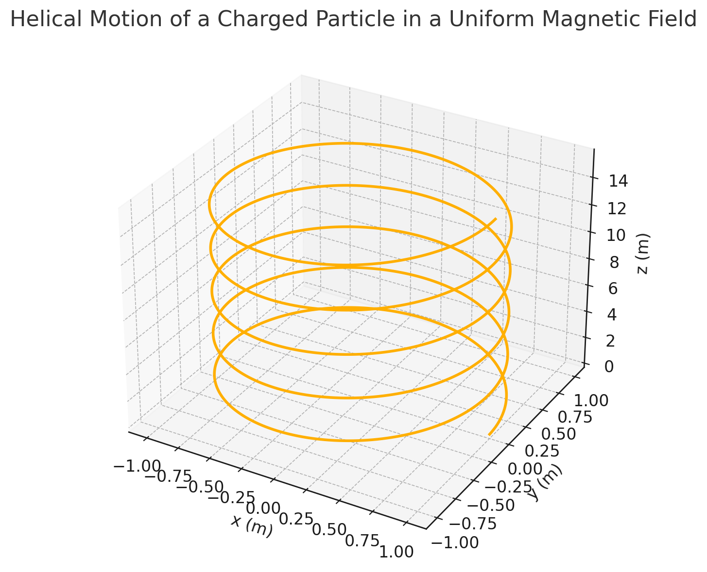

# Simulating the Effects of the Lorentz Force

## Introduction

The **Lorentz force**, described by the equation:

$\vec{F} = q\vec{E} + q\vec{v} \times \vec{B}$

is a foundational concept in electromagnetism. It governs the motion of charged particles in electric and magnetic fields and is widely applied in fields such as:

* Plasma physics
* Particle accelerators
* Mass spectrometry
* Astrophysics

Understanding this force provides insight into how we manipulate particles in experimental physics and industrial applications. This document presents an exploration and simulation of particle motion under various field configurations using Python.

---

## 1. Applications of the Lorentz Force

### Systems Where It Plays a Key Role:

* **Particle Accelerators**: Charged particles are bent using magnetic fields to increase energy. The Lorentz force is used to steer particles around circular paths.

* **Mass Spectrometers**: Use electric and magnetic fields to filter particles by mass-to-charge ratio. The trajectory of particles reveals their identity based on how the force affects their paths.

* **Plasma Confinement**: Magnetic fields trap particles in fusion reactors. Lorentz force maintains the confinement of high-temperature plasma.

* **Electric Field ($\vec{E}$)**: Accelerates particles, changing their speed and direction.

* **Magnetic Field ($\vec{B}$)**: Bends particle path, alters direction but keeps speed constant when no electric field is present.

---

## 2. Simulating Particle Motion

### Numerical Method

We use the **Runge-Kutta method** to integrate Newton's second law:

$\vec{F} = m\vec{a} = q(\vec{E} + \vec{v} \times \vec{B})$

This approach is stable and accurate for solving differential equations governing motion.

### Tools Used:

* `NumPy` for vector math
* `Matplotlib` for 2D/3D visualizations

### Scenario 1: Helical Motion ($\vec{B} \neq 0, \vec{E} = 0$)

```python
# Magnetic field in z-direction
B = np.array([0, 0, 1.0])
E = np.array([0, 0, 0])
v0 = np.array([1.0, 0.0, 1.0])
```

The trajectory shows a helical path due to the combined perpendicular and parallel velocity components with respect to $\vec{B}$.

### Visualization:



---

### Scenario 2: Crossed Fields ($\vec{E} \perp \vec{B}$)

```python
# Electric field in x, magnetic field in z
E = np.array([1.0, 0.0, 0.0])
B = np.array([0.0, 0.0, 1.0])
v0 = np.array([0.0, 1.0, 0.0])
```

This setup results in a spiral drift motion due to the $\vec{E} \times \vec{B}$ drift effect. The particle gains a net drift velocity perpendicular to both fields.

### Visualization:

**3D Path:**


**2D Projection on XY Plane:**


---

## 3. Parameter Exploration

Users can vary:

* Field strengths: $E, B$
* Initial velocity $\vec{v}_0$
* Charge $q$ and mass $m$

This allows simulation of different particles (e.g., electrons, protons) and field configurations. Users can also observe changes in trajectory shape, drift direction, and radius of curvature.

---

## 4. Real-World Applications

* **Cyclotron Radius**: $r = \frac{mv_\perp}{qB}$
* **Drift Velocity**: $\vec{v}_d = \frac{\vec{E} \times \vec{B}}{B^2}$

These concepts are key in designing cyclotrons, spectrometers, and plasma traps. For instance, the cyclotron radius determines how tightly a particle orbits in a magnetic field—a crucial factor in containment strategies for nuclear fusion.

---

## Conclusion

This simulation-based study helps visualize the abstract concepts of electromagnetism and is a stepping stone toward building simulations of real-world systems involving charged particles. Further extensions can include:

* Simulations with **non-uniform fields** (e.g., magnetic mirrors)
* Effects of **collisions** in a plasma
* **Relativistic corrections** for high-speed particles
* Adding **time-dependent fields** to study resonance effects

These extensions would enrich the model and make it applicable to cutting-edge research in physics and engineering.
