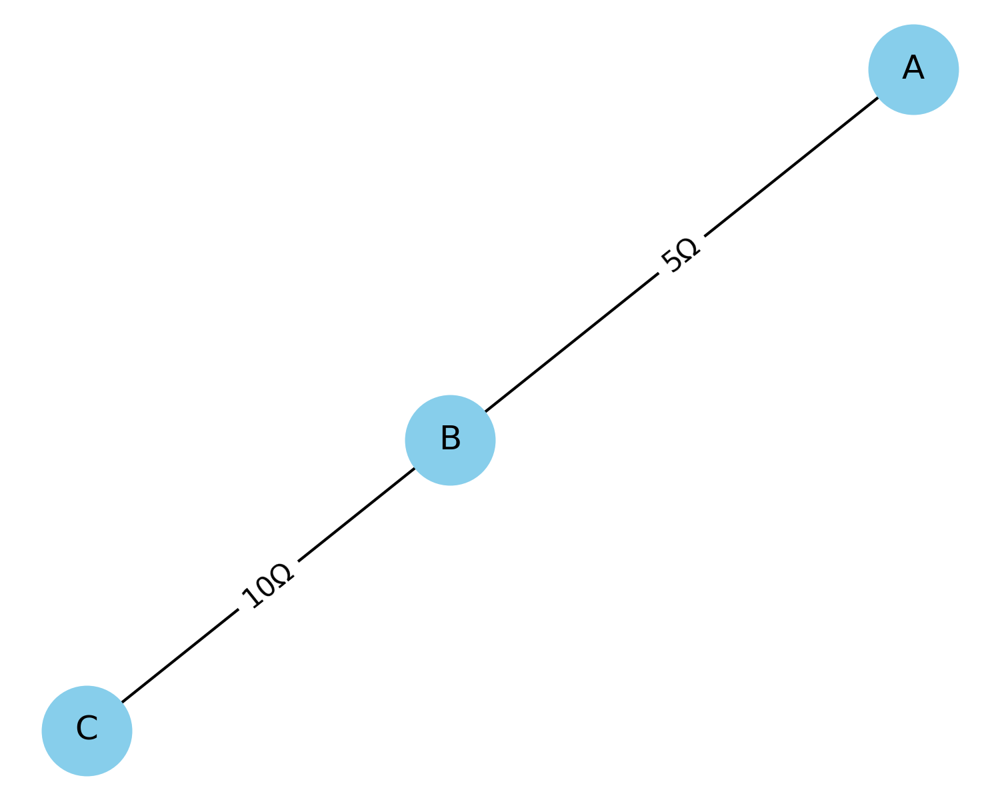
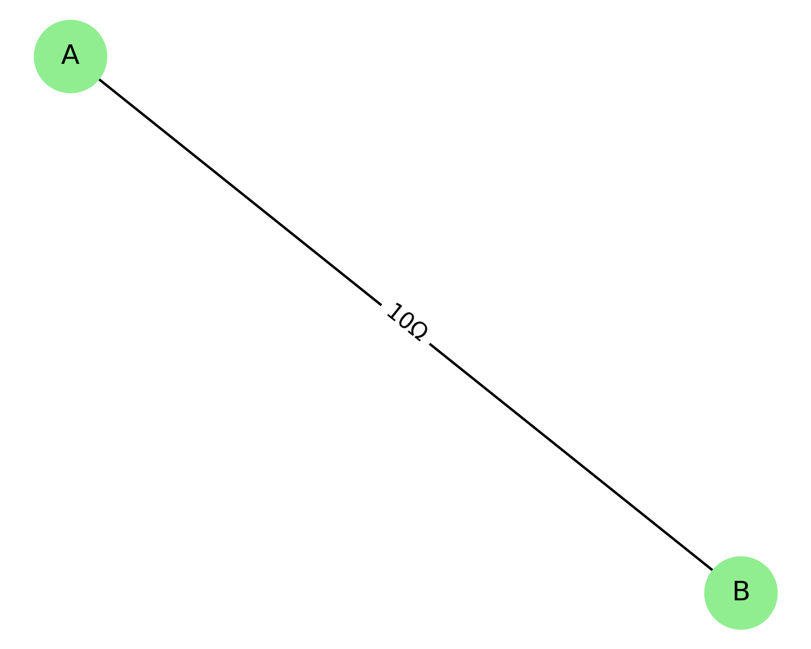
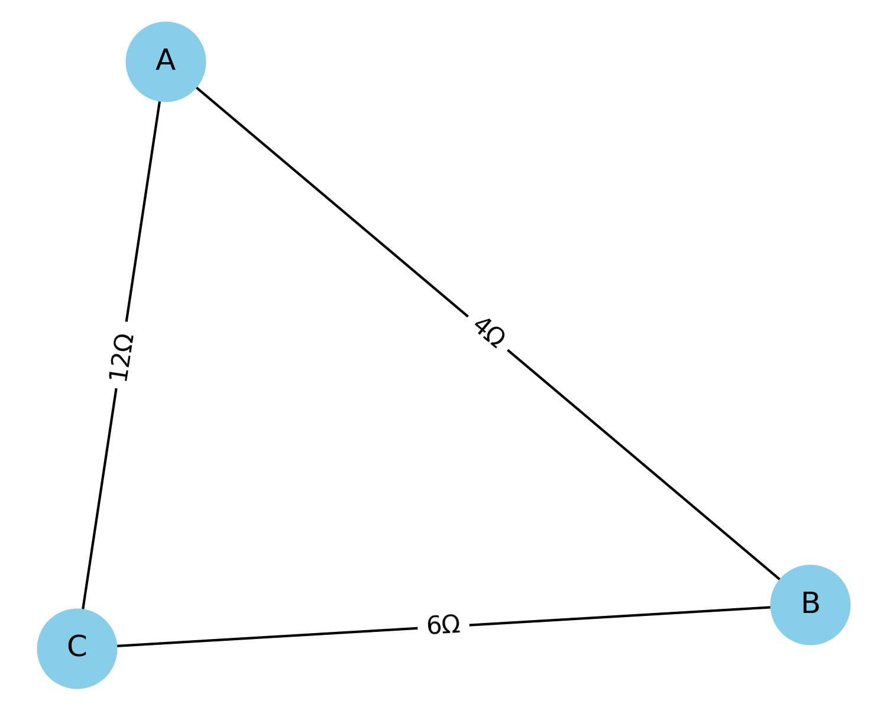

## Problem 1 
# Equivalent Resistance Using Graph Theory

##  Motivation

Calculating equivalent resistance is a fundamental problem in electrical circuits, essential for understanding and designing efficient systems. While traditional methods involve iteratively applying series and parallel resistor rules, these approaches can become cumbersome for complex circuits with many components.

**Graph theory** offers a powerful and algorithmic alternative:
- **Nodes** represent junctions.
- **Edges** represent resistors, with weights corresponding to resistance values.

This structured representation enables automated analysis and efficient simplification of electrical networks, making it highly relevant for modern simulation tools, optimization systems, and circuit design.

---

## 1. Applications of Graph-Based Circuit Modeling

Graph theory-based resistance modeling is used in:

* **Circuit Simulation Software** (e.g., SPICE): Efficient simplification and analysis.
* **Electrical Grid Design**: Reducing the number of components or calculating losses.
* **Optimization Algorithms**: Finding minimum-resistance paths or optimal topologies.
* **Robustness Testing**: Analyzing failure points and backup paths.

---

## 2. Task Options

### Option 1: Algorithm Description (Simplified Task)

We develop a **step-by-step algorithm** for calculating equivalent resistance using iterative graph reduction.

### Key Concepts:
- **Series Configuration**: A node with exactly two neighbors (degree 2) and no connection to source/target.
- **Parallel Configuration**: Multiple edges connecting the same pair of nodes.

### Pseudocode:

```plaintext
function simplify_graph(G, source, target):
    repeat
        for each node in G:
            if node has degree 2 and is not source or target:
                combine series edges into one
                remove node
        for each pair of connected nodes (u, v):
            if multiple edges exist:
                combine them into one edge with:
                    1 / R_eq = sum(1 / R_i)
    until G has only source and target
    return resistance between source and target
```

This algorithm detects and reduces nested combinations by recursively applying local transformations.

---

## 3. Full Implementation (Advanced Task)

Using Python and the `networkx` library:

```python
import networkx as nx

def merge_series(G, node):
    neighbors = list(G.neighbors(node))
    if len(neighbors) != 2:
        return
    u, v = neighbors
    R1 = G[u][node]['weight']
    R2 = G[node][v]['weight']
    G.add_edge(u, v, weight=R1 + R2)
    G.remove_node(node)

def merge_parallel(G):
    seen = set()
    for u, v in list(G.edges()):
        if (u, v) in seen or (v, u) in seen:
            continue
        edges = [d['weight'] for x, y, d in G.edges(data=True) if {x, y} == {u, v}]
        if len(edges) > 1:
            Req = 1 / sum(1 / R for R in edges)
            G.remove_edges_from([(x, y) for x, y, d in G.edges(data=True) if {x, y} == {u, v}])
            G.add_edge(u, v, weight=Req)
        seen.add((u, v))

def simplify(G, source, target):
    while len(G.nodes) > 2:
        for node in list(G.nodes):
            if G.degree[node] == 2 and node not in (source, target):
                merge_series(G, node)
        merge_parallel(G)
    return G[source][target]['weight']
```

---

## 4. Examples and Visuals

### A. Series Combination  
**Circuit:** A — 5Ω — B — 10Ω — C  
**Result:**  
$R_{eq} = 5 + 10 = 15\ \Omega$  


---

### B. Parallel Combination  
**Circuit:**  
A — 5Ω — B  
A — 10Ω — B  
**Result:**  
$R_{eq} = \left( \frac{1}{5} + \frac{1}{10} \right)^{-1} = \frac{10}{3} \approx 3.33\ \Omega$  


---

### C. Nested Combination (Triangle)  
**Circuit:**  
- AB = 4Ω, BC = 6Ω, AC = 12Ω  
- AB + BC = 10Ω in parallel with AC  
**Result:**  
$R_{eq} = \left( \frac{1}{10} + \frac{1}{12} \right)^{-1} = \frac{60}{11} \approx 5.45\ \Omega$  


---

## 5. Efficiency & Improvements

### Complexity:
- Each simplification step is linear with respect to nodes/edges.
- Multiple passes reduce the graph to a 2-node form.

### Enhancements:
- Handle **Y-Δ (star-delta)** transformations.
- Allow **AC impedance** calculations.
- Integrate with symbolic algebra systems (e.g., SymPy).

---

## Conclusion

Using graph theory to compute equivalent resistance is a scalable, powerful method suited for manual and automated analysis. Python implementation makes this approach practical for engineers and students alike.