# Statistics  
## Problem 1: Exploring the Central Limit Theorem Through Simulations

---

## 📘 Motivation

The **Central Limit Theorem (CLT)** is a foundational principle in statistics. It states:

> The sampling distribution of the sample mean becomes approximately normal as the sample size increases, **regardless of the shape of the original population distribution**.

This powerful result explains why normal distributions appear so frequently in statistical practice and underpins many real-world applications—from quality control to financial forecasting.

Using simulations, we can explore the CLT's behavior across various population distributions and sample sizes.

---

## 1. Simulating Sampling Distributions

We begin by generating populations using several different distributions:

- **Uniform Distribution**
- **Exponential Distribution**
- **Binomial Distribution**

Each population contains a large number of observations (e.g., 100,000 values) to approximate a true distribution.

---

## 2. Sampling and Visualization

To visualize the CLT, we repeatedly draw samples of various sizes and calculate their means.

### Process:
- Choose sample sizes: `n = 5, 10, 30, 50`
- Draw 1000 samples for each `n`
- Compute the sample means
- Plot histograms of those means

---

### 📊 Visual Demonstrations

#### Uniform Distribution
- 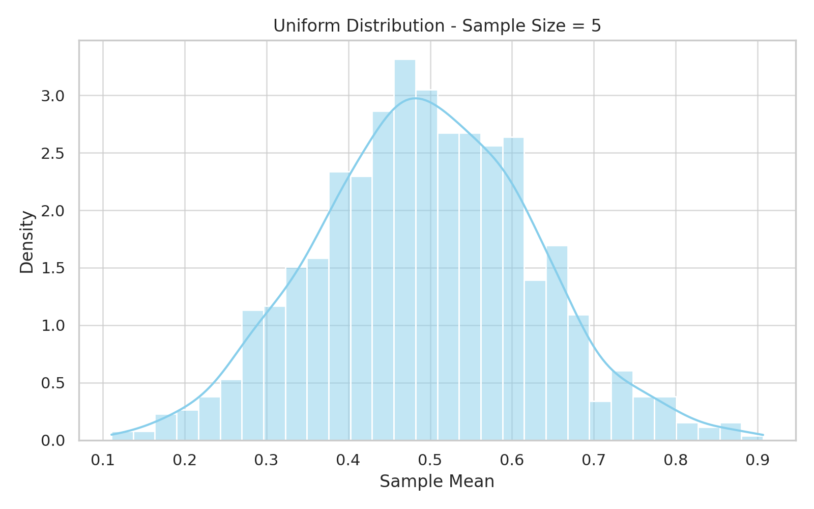
- 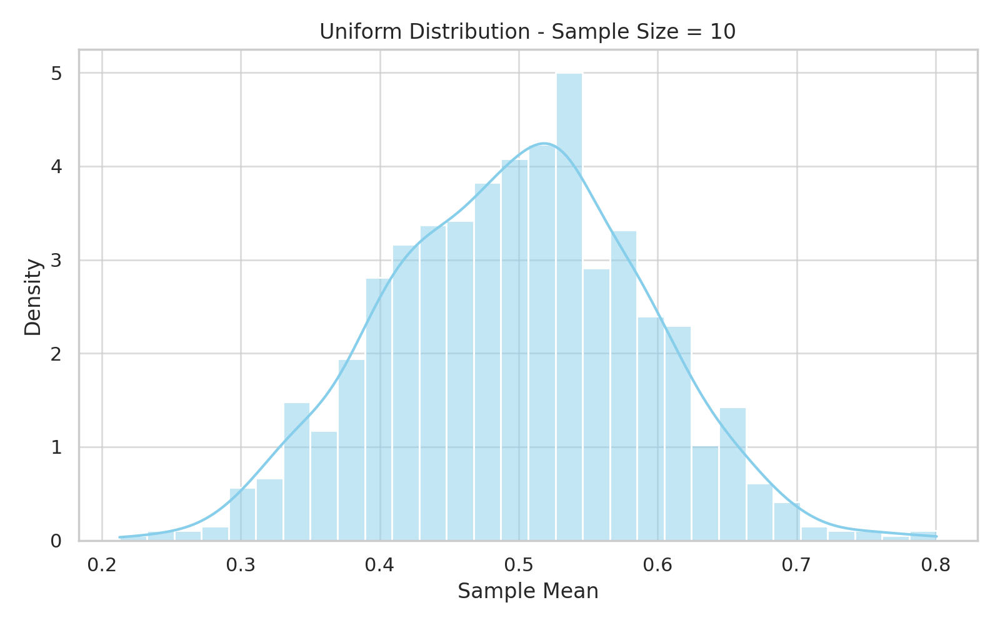
- 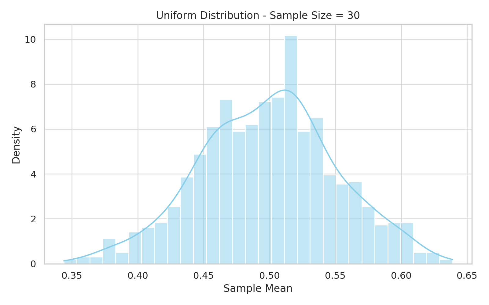
- 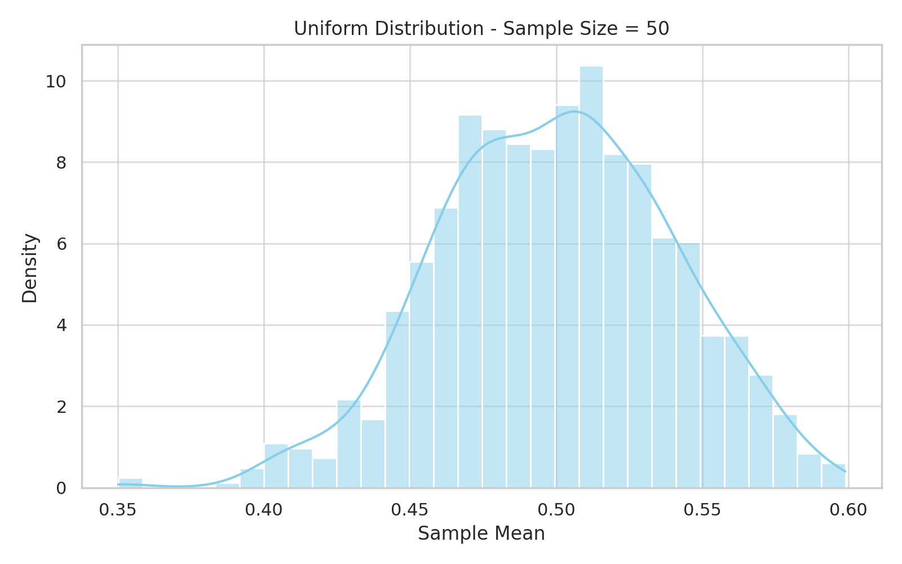

#### Exponential Distribution
- 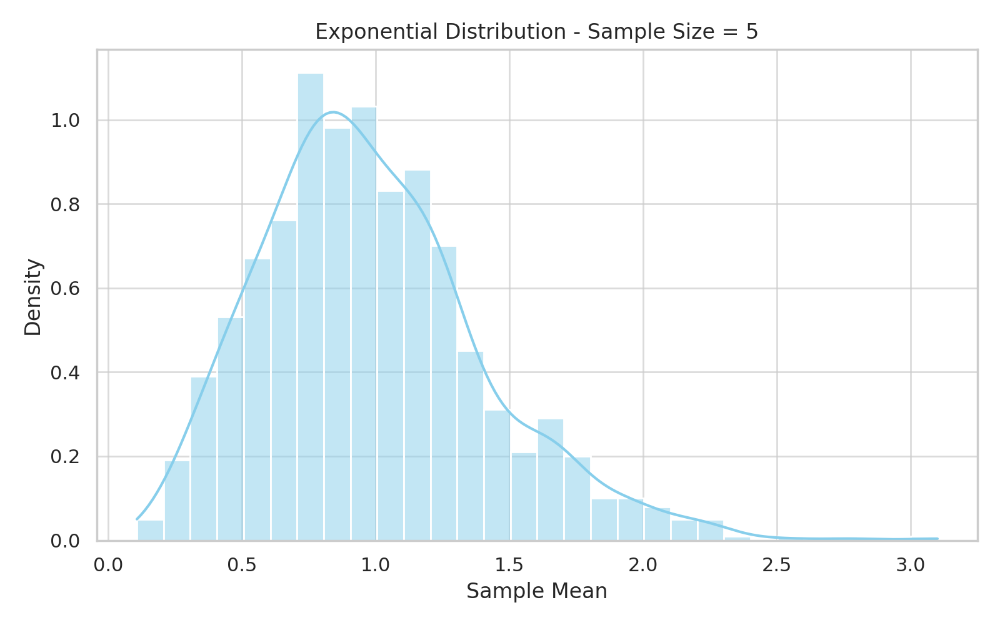
- 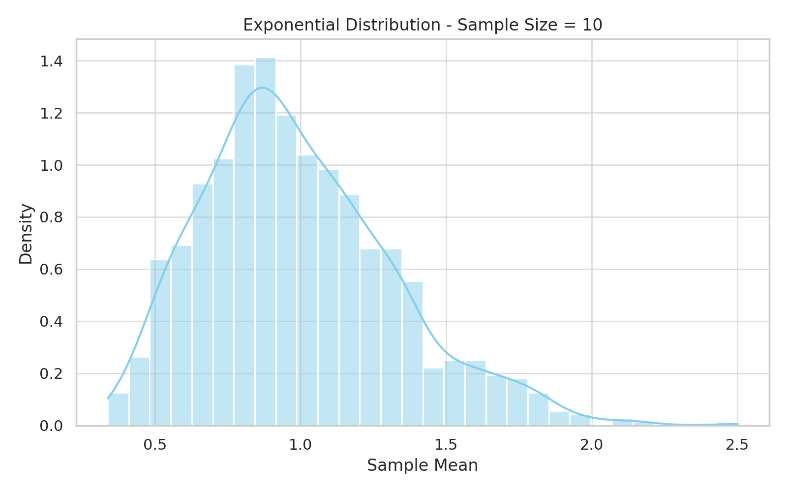
- 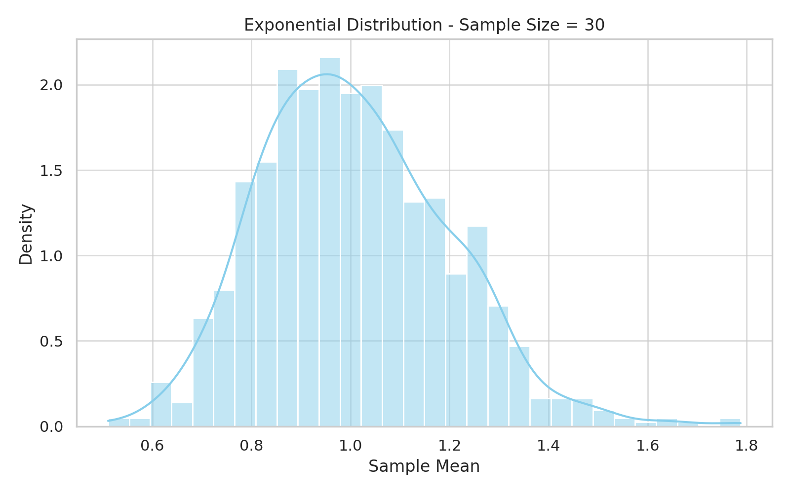
- 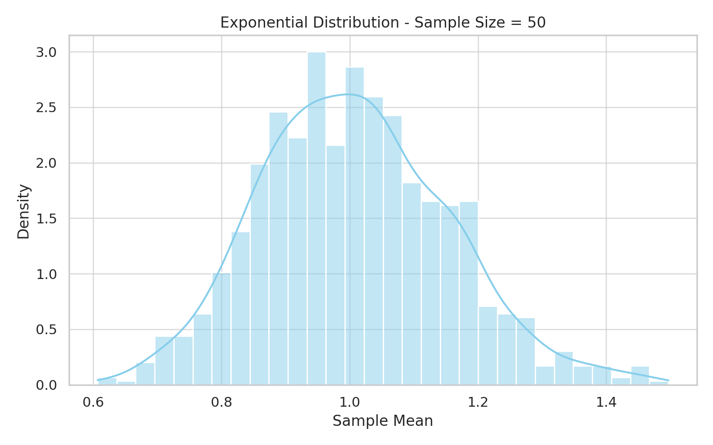

#### Binomial Distribution
- 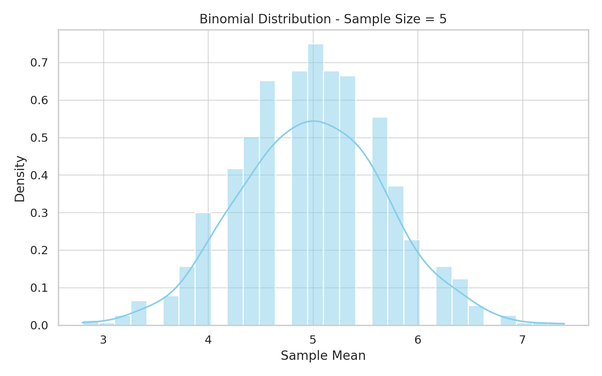
- 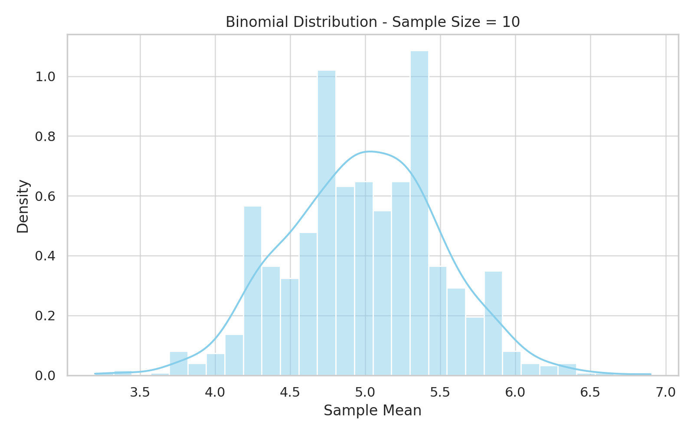
- 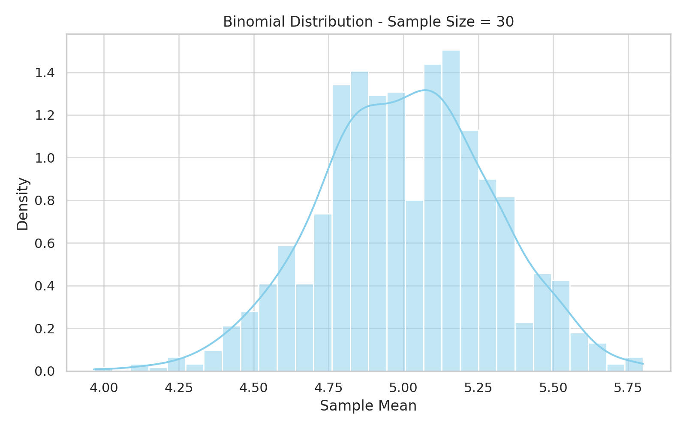
- 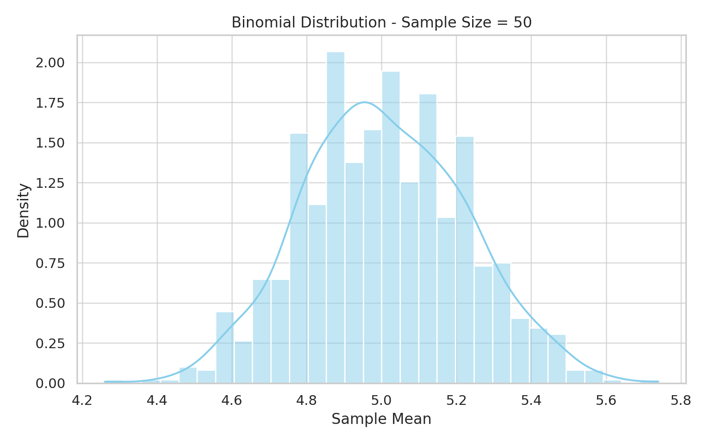

---

## 3. Parameter Exploration

### 🔍 How Shape Affects Convergence

- **Uniform**: Symmetric → fast convergence
- **Exponential**: Skewed → slower convergence
- **Binomial**: Convergence depends on `n` and `p`

### 🔍 How Variance Affects Spread

\[
\text{Var}(\bar{X}) = \frac{\sigma^2}{n}
\]

As `n` increases:
- Variance of the sample mean decreases
- The distribution becomes narrower and more normal

---

## 4. Practical Applications

- **Estimation**: Sample mean approximates population mean
- **Quality Control**: Monitor production processes
- **Finance**: Risk estimation and portfolio analysis
- **A/B Testing**: Business and tech experiments

---

## ✅ Conclusion

Simulating the Central Limit Theorem helps solidify intuition about sampling distributions and why the normal distribution arises so frequently in practice. Regardless of the source population's shape, the sample mean behaves predictably with large `n`.
