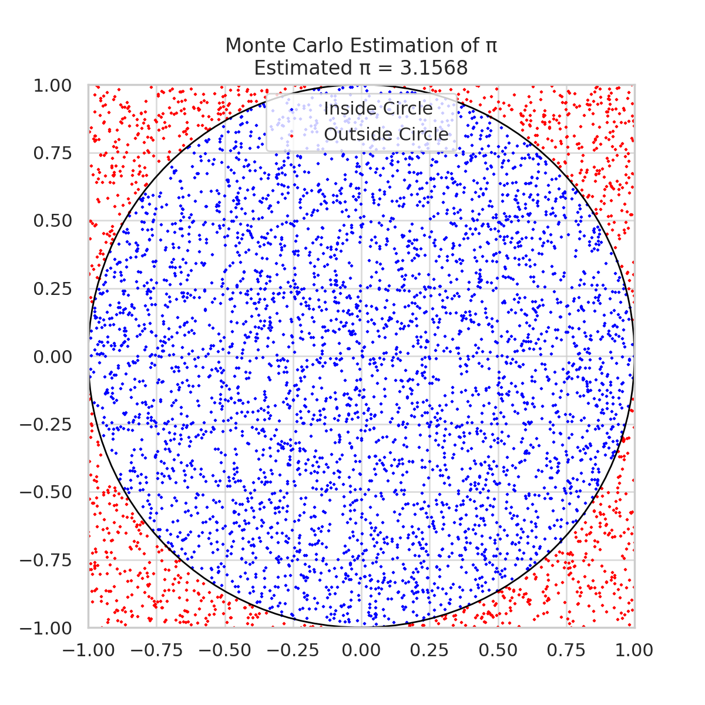
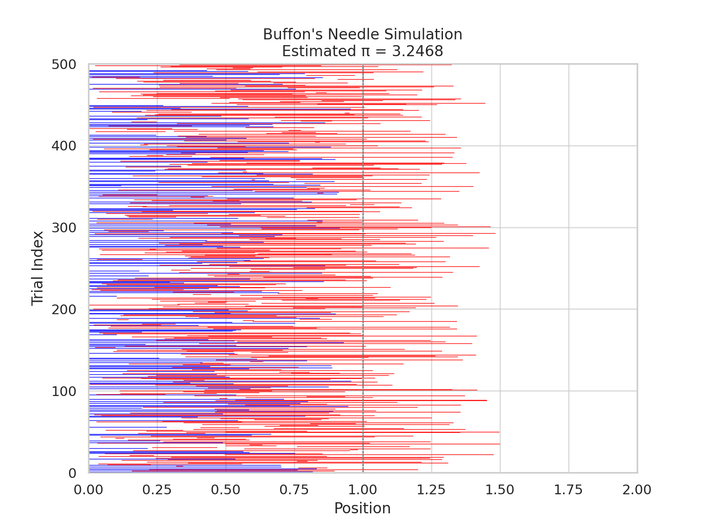

# 🧮 Problem 2: Estimating π Using Monte Carlo Methods

---

## 🎯 Motivation

Monte Carlo simulations are a powerful computational tool that uses **random sampling** to estimate mathematical quantities. A classic example is estimating the value of **π (pi)**. Two intuitive and historically significant methods are:

1. **Geometric probability using a unit circle.**
2. **Buffon’s Needle experiment.**

These methods illustrate how randomness can approximate deterministic values and are widely used in physics, finance, and engineering.

---

## 🔢 Part 1: Estimating π Using a Circle

### 📚 Theoretical Foundation

The area of a **unit circle** (radius = 1) is:

$$
A = \pi r^2 = \pi
$$

If we embed the unit circle inside a **square** of side 2 (from -1 to 1), the area of the square is:

$$
A_{\text{square}} = 4
$$

If we randomly generate points within the square, the proportion that falls inside the circle is:

$$
\frac{\text{Points in Circle}}{\text{Total Points}} \approx \frac{\pi}{4}
$$

Thus, we estimate π as:

$$
\pi \approx 4 \cdot \frac{\text{Points in Circle}}{\text{Total Points}}
$$

---

### 💻 Python Simulation (Circle Method)

```python
import numpy as np
import matplotlib.pyplot as plt

N = 10000
x = np.random.uniform(-1, 1, N)
y = np.random.uniform(-1, 1, N)

inside = x**2 + y**2 <= 1
pi_estimate = 4 * np.sum(inside) / N

# Plot
plt.figure(figsize=(6, 6))
plt.scatter(x[inside], y[inside], color='green', s=1, label='Inside Circle')
plt.scatter(x[~inside], y[~inside], color='red', s=1, label='Outside Circle')
plt.title(f"Monte Carlo π Estimate: {pi_estimate:.4f}")
plt.xlabel("x")
plt.ylabel("y")
plt.axis("equal")
plt.legend()
plt.grid(True)
plt.savefig("monte_carlo_circle.png")
plt.show()
```

---

### 📊 Visualization



---

## 🧪 Part 2: Estimating π Using Buffon’s Needle

### 📚 Theoretical Foundation

Buffon’s Needle problem estimates π by simulating **dropping a needle** of length ℓ on a floor with parallel lines spaced **d** units apart. If ℓ ≤ d, the probability **P** of the needle crossing a line is:

$$
P = \frac{2\ell}{\pi d}
\quad \Rightarrow \quad
\pi \approx \frac{2\ell \cdot \text{Number of drops}}{d \cdot \text{Crosses}}
$$

---

### 💻 Python Simulation (Buffon's Needle)

```python
import numpy as np
import matplotlib.pyplot as plt

def buffon_simulation(n_drops=10000, needle_length=1.0, line_spacing=1.5):
    crosses = 0
    x_coords, y_coords = [], []

    for _ in range(n_drops):
        center = np.random.uniform(0, line_spacing / 2)
        angle = np.random.uniform(0, np.pi / 2)

        tip = center + (needle_length / 2) * np.sin(angle)
        if tip >= line_spacing / 2:
            crosses += 1

        x_coords.append(center)
        y_coords.append(angle)

    pi_estimate = (2 * needle_length * n_drops) / (line_spacing * crosses)
    return pi_estimate, x_coords, y_coords

pi_buffon, x_vals, y_vals = buffon_simulation()

# Visualization
plt.figure(figsize=(8, 4))
plt.scatter(x_vals, y_vals, s=1, color='blue')
plt.title(f"Buffon's Needle π Estimate: {pi_buffon:.4f}")
plt.xlabel("Needle center (x)")
plt.ylabel("Angle (rad)")
plt.grid(True)
plt.savefig("buffons_needle.png")
plt.show()
```

---

### 📊 Visualization



---

## 📈 Accuracy and Convergence

* **Monte Carlo Circle Method** improves in accuracy with more points.
* **Buffon’s Needle Method** converges slower and depends on angle randomness.
* Circle method generally gives better estimates for fewer trials.

---

## ✅ Conclusion

Both methods reveal how **randomness and geometry** can approximate π:

* The **circle method** is visually intuitive and computationally efficient.
* The **Buffon’s needle** experiment connects physical probability and mathematics.

These simulations illustrate core ideas of **numerical approximation, convergence, and statistical estimation**.

