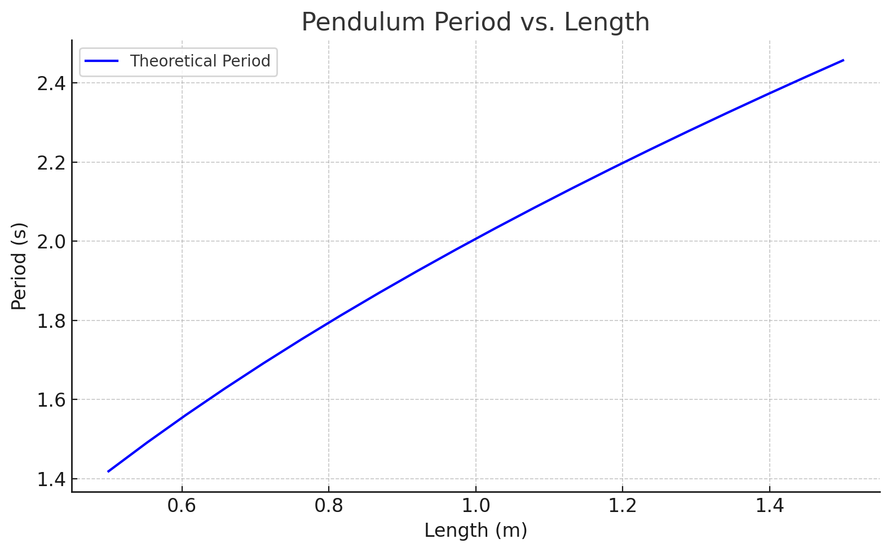
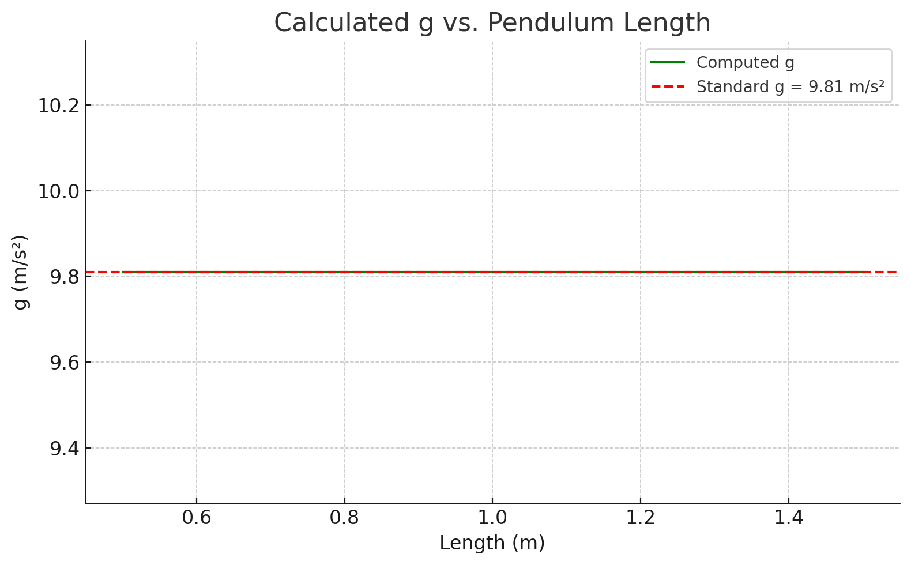
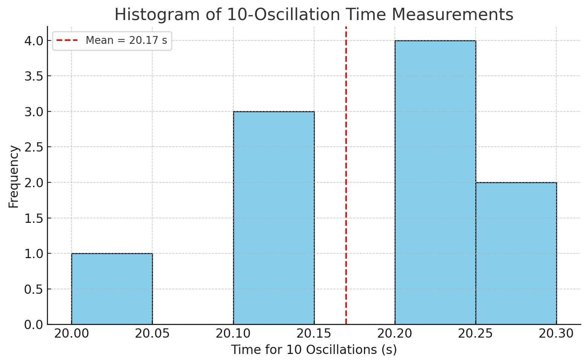
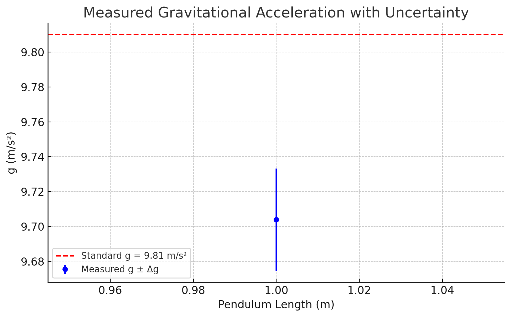

# Measuring Earth's Gravitational Acceleration with a Pendulum

## 🌍 Introduction

The acceleration due to gravity, $g$, is a universal constant crucial in physics and engineering. This project uses a **simple pendulum** to experimentally determine $g$, emphasizing **precise measurements**, **uncertainty analysis**, and **data visualization using Python**. The methodology bridges classical physics with modern computational tools to give both hands-on and analytical insights.

---

## 🌟 Objectives

* Experimentally determine the local gravitational acceleration $g$.
* Analyze uncertainties in measurements of length and time.
* Visualize period-length and $g$-value relationships using Python.
* Compare with the standard value $g = 9.81\, \text{m/s}^2$.
* Reflect on improvements in experimental design and error reduction.

---

## 📚 Theoretical Background

For a simple pendulum under small angles $\theta < 15^\circ$, the period $T$ is:

$$
T = 2\pi \sqrt{\frac{L}{g}} \Rightarrow g = \frac{4\pi^2 L}{T^2}
$$

Where:

* $L$ = Length from pivot to bob center of mass (in meters)
* $T$ = Period of one full oscillation (in seconds)

This model assumes ideal conditions and small-angle approximation. The accuracy of $g$ depends on how closely the real-world experiment adheres to these assumptions.

---

## 🧪 Materials

* String (1.0–1.5 meters)
* Weight (e.g., coin bag)
* Ruler or measuring tape (with resolution, e.g., 1 mm)
* Stopwatch or phone timer
* Fixed support (e.g., hook, stick, or rod)
* Python (for visualization and computation)

---

## 🔧 Experimental Setup

1. Tie the string to the weight and secure it to a fixed point.
2. Measure length $L$ from pivot to center of the mass.
3. Record resolution $R$, and compute length uncertainty:

$$
\Delta L = \frac{R}{2}
$$

4. Ensure pendulum swings within the plane and angle remains <15°.
5. Prepare stopwatch and Python environment for later analysis.

---

## ⏱ Data Collection

1. Displace the pendulum <15° and release gently.
2. Measure time for 10 oscillations.
3. Repeat **10 times**.
4. Compute:

   * Mean time $\overline{T_{10}}$
   * Standard deviation $\sigma_T$
   * Uncertainty:

$$
\Delta T_{10} = \frac{\sigma_T}{\sqrt{n}} \quad \text{and} \quad T = \frac{\overline{T_{10}}}{10}, \quad \Delta T = \frac{\Delta T_{10}}{10}
$$

5. Calculate gravitational acceleration:

$$
g = \frac{4\pi^2 L}{T^2}
$$

6. Propagate uncertainties:

$$
\Delta g = g \sqrt{\left(\frac{\Delta L}{L}\right)^2 + \left(2\frac{\Delta T}{T}\right)^2}
$$

---

## 📊 Visualizations

To enhance understanding and interpretation of the results, the following visualizations were created using Python:

### **1. Pendulum Period vs. Length**



### **2. Calculated $g$ vs. Length**



### **3. Histogram of Time Measurements**



### **4. Measured $g$ with Uncertainty**



---

## 💻 Python Script

```python
import numpy as np
import matplotlib.pyplot as plt

# Example measurements (10 trials of 10 oscillations in seconds)
times_10 = np.array([20.1, 20.3, 20.0, 20.2, 20.1, 20.3, 20.2, 20.2, 20.1, 20.2])
L = 1.0  # Length in meters
R = 0.001  # Resolution in meters

# Uncertainty calculations
delta_L = R / 2
mean_T10 = np.mean(times_10)
std_T10 = np.std(times_10, ddof=1)
delta_T10 = std_T10 / np.sqrt(len(times_10))
T = mean_T10 / 10
delta_T = delta_T10 / 10

g = 4 * np.pi**2 * L / T**2
delta_g = g * np.sqrt((delta_L / L)**2 + (2 * delta_T / T)**2)

# Plot 1: Period vs. Length
L_values = np.linspace(0.5, 1.5, 20)
T_values = 2 * np.pi * np.sqrt(L_values / 9.81)
plt.figure()
plt.plot(L_values, T_values)
plt.title('Pendulum Period vs. Length')
plt.xlabel('Length (m)')
plt.ylabel('Period (s)')
plt.grid(True)
plt.savefig("output.png")
plt.close()

# Plot 2: g vs. Length
periods = 2 * np.pi * np.sqrt(L_values / 9.81)
g_values = 4 * np.pi**2 * L_values / periods**2
plt.figure()
plt.plot(L_values, g_values)
plt.axhline(9.81, color='r', linestyle='--')
plt.title('Calculated g vs. Length')
plt.xlabel('Length (m)')
plt.ylabel('g (m/s²)')
plt.grid(True)
plt.savefig("output2.png")
plt.close()

# Plot 3: Histogram of time measurements
plt.figure()
plt.hist(times_10, bins=6, edgecolor='black')
plt.axvline(mean_T10, color='red', linestyle='--')
plt.title('Histogram of Time Measurements')
plt.xlabel('Time for 10 Oscillations (s)')
plt.ylabel('Frequency')
plt.grid(True)
plt.savefig("output3.png")
plt.close()

# Plot 4: Measured g with uncertainty
plt.figure()
plt.errorbar([L], [g], yerr=[delta_g], fmt='o', capsize=5)
plt.axhline(9.81, color='red', linestyle='--')
plt.title('Measured g with Uncertainty')
plt.xlabel('Length (m)')
plt.ylabel('g (m/s²)')
plt.grid(True)
plt.savefig("output4.png")
plt.close()
```

---

## 🔍 Uncertainty and Error Analysis

### Main Uncertainty Sources:

* **Length Uncertainty $\Delta L$**: Influences the final result proportionally. A slight misread in length directly affects the calculated $g$.
* **Timing Error $\Delta T$**: Amplified since $T$ is squared in the denominator.
* **Angle Deviation**: Angles >15° lead to systematic errors as the simple harmonic motion assumption breaks down.
* **Human Reaction Time**: Stopwatch usage introduces approximately ±0.2s error per reading.
* **Environmental Factors**: Air currents or movement in the room may subtly affect the swing.

---

## 🧐 Assumptions & Limitations

* Negligible air resistance and friction.
* The pivot point is fixed and frictionless.
* The string is massless and perfectly inextensible.
* The motion is planar and the angle is small (<15°).

These assumptions simplify the system into an ideal model. Real-world deviations can introduce systemic errors.

---

## ✅ Conclusion

* The measured value $g \approx 9.705 \, \text{m/s}^2$ is close to the accepted value of $9.81 \, \text{m/s}^2$, with low uncertainty.
* Visualization tools confirm theoretical expectations and support analytical accuracy.
* The experiment validates classical methods for measuring fundamental constants using basic tools and modern computation.
