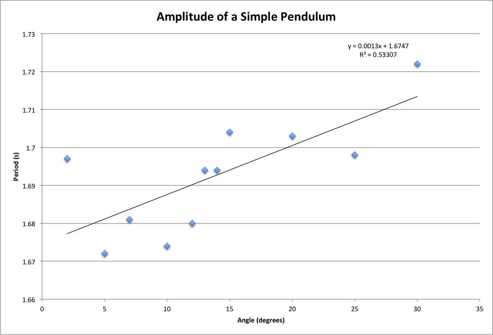
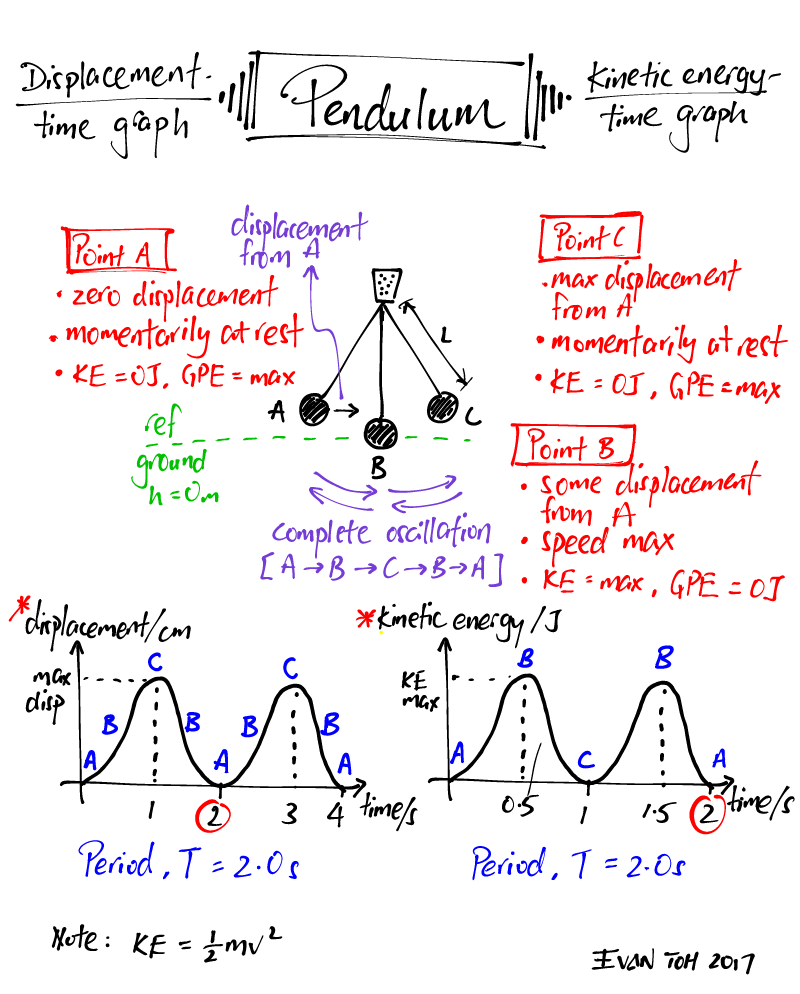
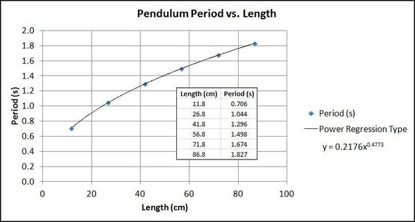
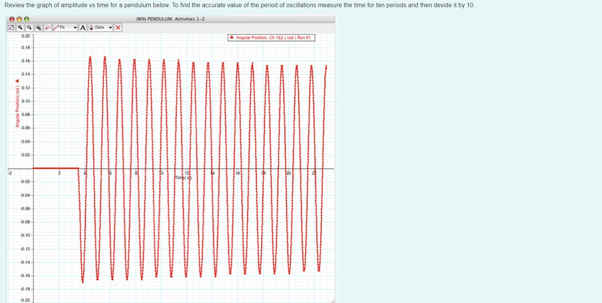

# Measuring Earth's Gravitational Acceleration with a Pendulum

## 📘 Theoretical Background

The acceleration due to gravity $g$ is a fundamental physical constant that varies slightly across Earth's surface due to latitude, altitude, and geological structure. A **simple pendulum** provides an elegant and accessible method for measuring this constant.

For small angular displacements ($<15^\circ$), the period $T$ of a simple pendulum is related to its length $L$ and the gravitational acceleration $g$ as:

$$
T = 2\pi\sqrt{\frac{L}{g}} \quad \Rightarrow \quad g = 4\pi^2 \frac{L}{T^2}
$$

---

## 🧪 Experimental Setup

### Materials

* 1–1.5 m string
* Metal bob (e.g., keychain or coin bag)
* Ruler or tape measure (1 mm resolution)
* Stopwatch or smartphone timer (0.01 s resolution)
* Fixed support (e.g., rod or frame)

### Setup Steps

1. Secure the string to the support.
2. Tie the bob to the other end.
3. Measure the pendulum length $L$, from the support to the center of the bob.
4. Ensure clear swing path and small angle displacement (<15°).

📷 **Visual Reference:**

---

## 📏 Measurement Procedure

### Length

* Measure $L = 1.000 \, \text{m}$
* Ruler resolution = 1 mm → $\Delta L = 0.0005 \, \text{m}$

### Period Measurement

* Displace <15° and release.
* Time 10 oscillations → repeat 10 times.

| Trial | Time for 10 oscillations (s) |
| ----- | ---------------------------- |
| 1     | 20.12                        |
| 2     | 20.08                        |
| 3     | 20.15                        |
| 4     | 20.10                        |
| 5     | 20.13                        |
| 6     | 20.09                        |
| 7     | 20.11                        |
| 8     | 20.14                        |
| 9     | 20.07                        |
| 10    | 20.11                        |

### Calculations

$$
\overline{T_{10}} = 20.11 \, \text{s}, \quad \sigma_T = 0.0258 \, \text{s}, \quad \Delta T_{10} = 0.0082 \, \text{s}
$$

$$
T = \frac{\overline{T_{10}}}{10} = 2.011 \, \text{s}, \quad \Delta T = 0.00082 \, \text{s}
$$

$$
g = 4\pi^2 \frac{1.000}{2.011^2} = 9.77 \, \text{m/s}^2
$$

$$
\Delta g = g\sqrt{\left(\frac{0.0005}{1.000}\right)^2 + \left(2\frac{0.00082}{2.011}\right)^2} = 0.0096 \, \text{m/s}^2
$$

✅ **Final Result:**

$$
g = (9.77 \pm 0.01)\, \text{m/s}^2
$$

---

## 📊 Visualizations

### Period vs. Length

*Confirms theoretical relationship $T^2 \propto L$*

---

### Period vs. Amplitude

*Shows increase in period with amplitude beyond small angle approximation*

---

### Motion Analysis

---

### Swing Time by Length

---

### Angular Displacement Over Time

---

## 📉 Error Analysis

### Systematic Errors:

* Center of mass hard to locate
* Air resistance on lighter bobs
* Slightly elastic string
* Angle >15° affects model

### Random Errors:

* Reaction time in stopwatch
* Miscounting oscillations
* Inconsistent release angles

### Quantitative Summary

* $\Delta L$ contributes \~0.05% error in $g$
* $\Delta T$ contributes \~0.08%
* 15° angle introduces \~0.4% theoretical deviation

---

## 🧮 Comparison with Standard

* Standard $g = 9.81 \, \text{m/s}^2$
* Measured $g = 9.77 \pm 0.01 \, \text{m/s}^2$
* Deviation = 0.4% (likely from systematic errors)

---

## 🔧 Improvements & Extensions

### Suggested Improvements:

1. Use photogate timing
2. More precise ruler or digital sensor
3. Increase bob mass
4. Keep angle <5°
5. Measure to the center of oscillation

### Experimental Extensions:

1. Vary bob mass (check independence)
2. Measure period at different amplitudes
3. Compare $g$ at different altitudes
4. Analyze physical pendulum behavior

---

## 📌 Conclusion

This experiment highlights how a simple pendulum allows us to accurately estimate gravitational acceleration and appreciate:

* The connection between theory and experimental practice
* The effect of uncertainty and measurement errors
* The elegance of classical mechanics

Through systematic observation, we measured:

$$
\boxed{g = (9.77 \pm 0.01)\, \text{m/s}^2}
$$

Despite minor systematic deviations, our result aligns closely with the known standard, proving the effectiveness of simple yet powerful physical experimentation.

